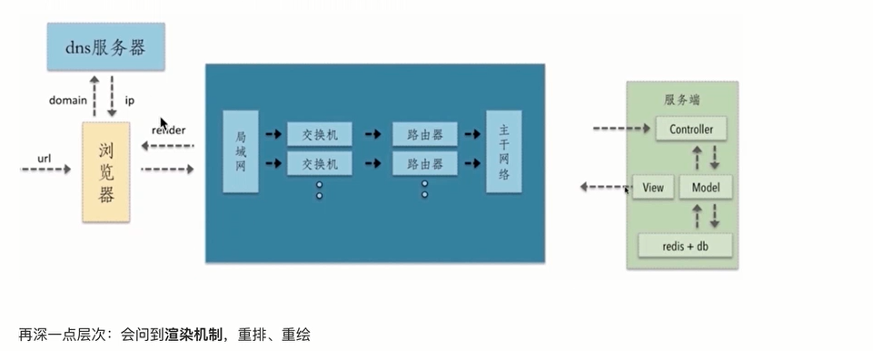
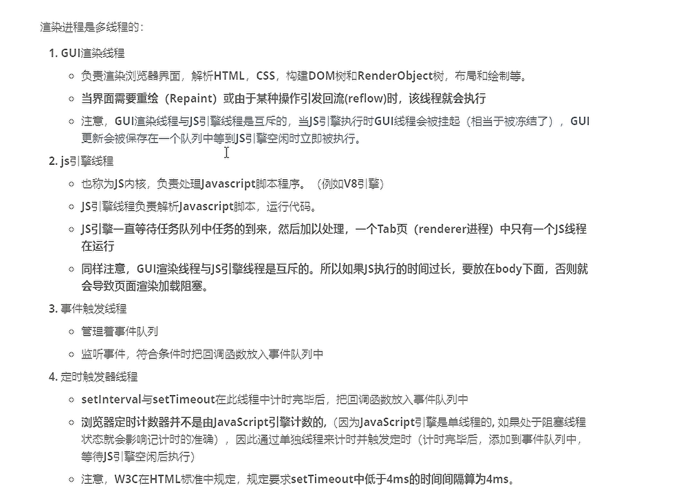
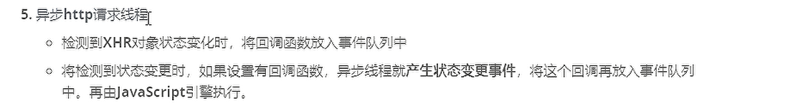
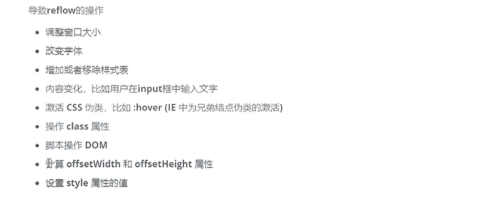
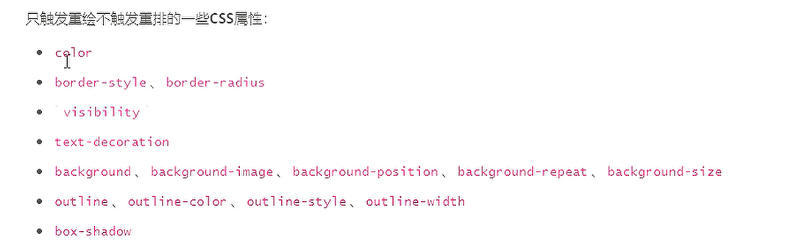
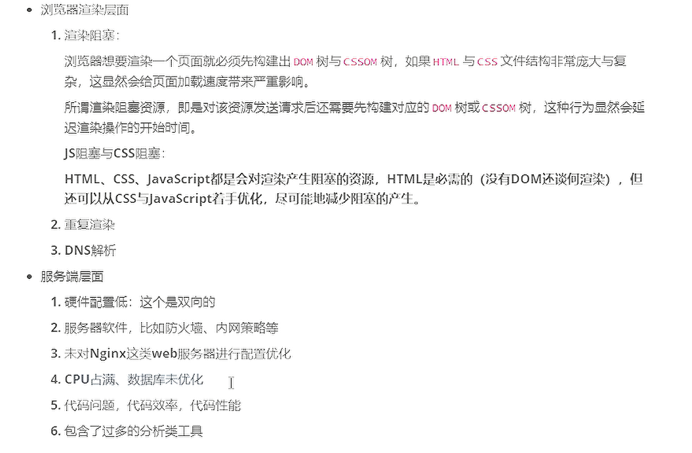
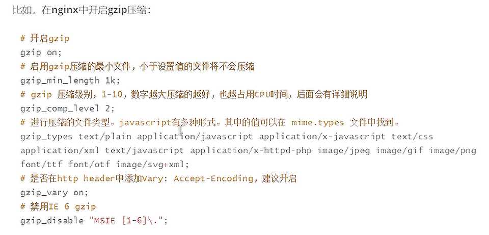
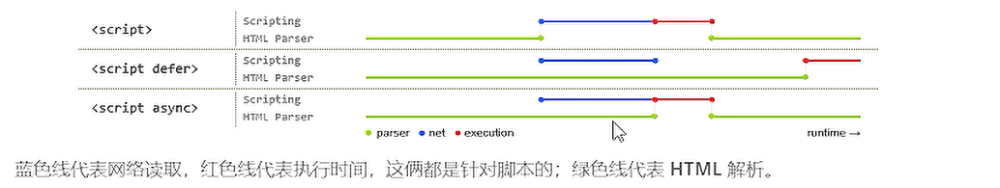
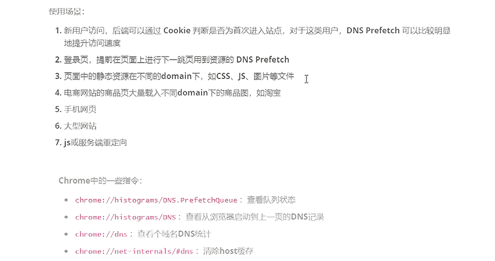
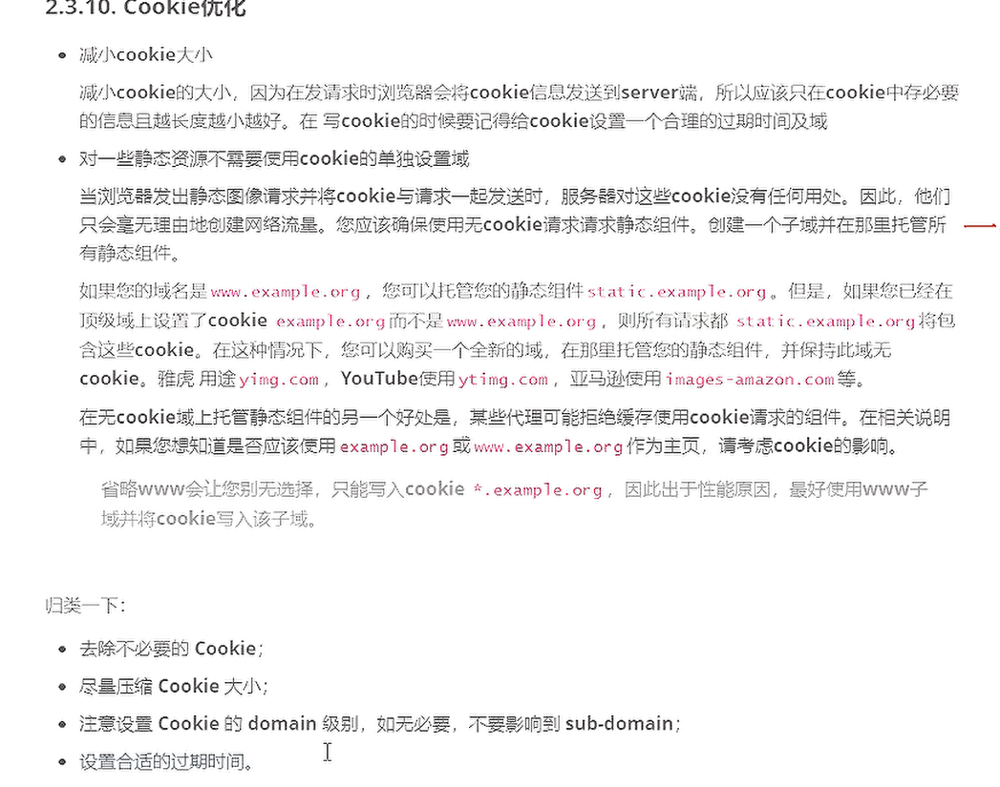

  

浏览器是多进程的，进程里面有多个线程

- Browser进程：浏览器的主进程，只有一个，负责浏览器界面显示，与用户加护，负责各个界面的管理，创建和销毁，将render进程从内存中得到的bitmap绘制到用户界面上，网络资源的管理。

- 第三方插件进程：每个插件均有一个，只有使用该插件的时候，才会创建该进程。

- GPU进程：最多一个，用于3D绘制

- Render进程：渲染进程，默认每一个页面一个渲染进程，互不影响，主要作用为页面渲染。

## 渲染进程

是多线程的





 ## 重排reflow与重绘repaint

因为大小和位置等发生变化会导致布局重排，重新构建过程称为回流，每个页面至少有一次回流，即第一次加载的时候。重排之后会进行重绘



因为可见性，颜色和边框等可见样式属性发生变化会导致重绘。



减少重排和重绘：

- js减少访问DOM和css,减少修改操作，可以利用虚拟dom
- 减少不必要的DOM层级，因为dom一级改变，所有层级改变
- 不要通过父级来改变子元素样式，要相互独立，减少修改次数
- 尽可能使用class设计样式，减少style多次操作单个属性（div.style.top = '2px'）
- 对于动画元素，尽可能使用fixed或absolute的position，这样不会导致重排。
- img标签直接设置宽高，不需要包裹div
- 使用transform做形变和位移，不会导致回流
- 减少复杂css样式选择器，减少cpu消耗
- tables布局，将table-layout设置为auto或fixed，这样不会导致局部改变渲染整体

## 页面慢的原因



## 优化原则

### 减少HTTP请求

- 浏览器输入网址
- 浏览器与网址只想的服务器建立连接
- 浏览器向相应的服务器发送请求
- 接受到请求后进行解析

1、组合文件，如将多个图片合并为一个图片（sprites），利用background-position控制显示

2、使用内联图片，如直接使用base64编码，减少请求


### 使用内容分发网络CDN

cdn是分布在多个地理位置的WEB服务器集合，选择少跳数或最快响应时间的服务器

### 避免空的src和href

增加服务器流量和压力

<a href='void(0)'></a>

### gzip文件压缩

1. Gzip 常用于 Web 开发中，通过压缩 HTML、CSS、JavaScript 和其他文本文件来减少网页加载时间。
2. 现代 Web 服务器和浏览器都支持 Gzip 压缩，可以在服务器端自动压缩响应内容，并在客户端自动解压。

```
Accept-encoding:gizp,deflate
```



### css在顶部，js在底部

css：

css先下载，减少页面重排和跳动，然后会阻塞构建CSSOM

使用css媒体类型，对特定使用条件下的css,进行阻塞

```
<link href='style.css' rel='stylesheet' media='print'>    //只在打印时阻塞
```

js：



```
<script defer='defer' src='/ddsfs'>   //推荐
<script defer='async' src='/ddsfs'>
```

浏览器正常遇到js文件就会阻塞，先顺序下载然后执行js文件

异步下载js文件

defer是在页面解析完成时执行js文件，顺序是按照加载顺序

async是乱序执行的，只要被下载完就会执行

### 减少DNS查找

1、浏览器输入地址

2、本地DNS会根据缓存查找ip,无则向DNS服务器发送请求

3、得到ip后，浏览器向指定ip发送请求

dns预解析：

```
<link rel='des-prefetch' href='ww.baidu.com' />
```



### 压缩资源

webpack,gulp

### ajax优化

post请求会发送两次请求，并且不会在客户端缓存

get请求只发生一次，并且默认会进行缓存

### cookie优化



### 利用缓存

### 缩短服务器响应时间

# 详细查看 

E:\BaiduNetdiskDownload\在职加薪课：架构与运维\阶段5：架构与运维\05-1 前端性能优化\resource
