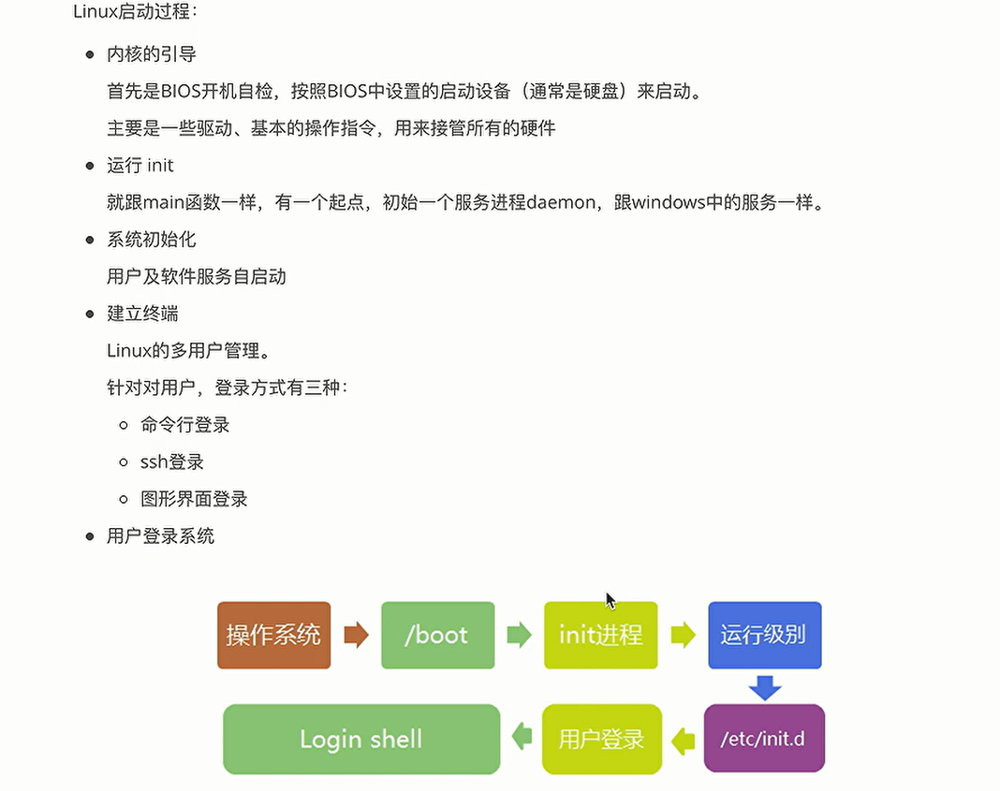

# linux（Ubuntu）




## 命令

- 文件

  ls -la   显示所有文件，包括隐藏文件

  pwd       查看当前文件所在目录

  touch a.txt   创建文件

  echo 'hello' >> a.txt     //输出到文件中

  cat a.txt   	//查看文件的内容

  rm -rf *     	//强制删除当前文件夹全部文件

  rm -f dir    	 //删除目录

  mv a.txt dir/a.txt  //移动文件

  cp b.txt a.txt   	//复制b到a

  tar -zxvf a.tar.gz     //解压文件

  wget -o /temp/a.tar.gz http://nginx/a.tar.gz   //从网路下载文件

  

- 权限
  文件类型1+所有者用户权限3+组用户权限3+其他用户权限3
  文件类型：d表示文件夹，—表示文件
  用户权限：r表示读，权值为4，w表示写，权值为2，x表示操作，权值为1
  chmod   +x  a.txt   所有用户加X权限
  chmod  733  a.txt  表示\_rwx_wx_wx权限
  chmod  733   -R  dir/    为文件夹下所有文件添加相同权限
  
  
  
  -R   表示递归，处理全部文件
  
  chown user1 a.txt   //将文件拥有者变为user1
  
  chown user1：group1 a.txt   //将文件的拥有者和组改变
  
  
  
  | useradd  user1             | su user1         |      |
  | :------------------------- | ---------------- | ---- |
  | groupadd gruop1            |                  |      |
  | usermod -a -G group1 user1 | 将用户添加到组中 |      |
  
- 网络

  

  

  | ip addr                               |                              |
  | ------------------------------------- | ---------------------------- |
  | ssh -p 22 root @10.2.3.123            | root用户连接到IP地址的22端口 |
  | vi /etc/ssh/ssh_config                | 对ssh连接进行配置            |
  | service ssh restart（Debian，Ubuntu） | 修改配置文件后，重启         |
  | ifconfig                              | 查看网卡信息                 |
  | ifconfig ens33 down                   | 停止网卡                     |
  | ifconfig ens33 netmask 255.255.0.0    |                              |

  
  
  
  
  | netstat                                   |
  | ----------------------------------------- |
  | sudo netstat -alnp \| grep ssh（grep 22） |
  
  

  

  | route                                                   | 查看路由信息           |
  | ------------------------------------------------------- | ---------------------- |
  | route add -net 192.168.0.0 netmask 255.255.0.0 dev eth0 | 添加路由信息，网口信息 |
  | route del -net 192.168.0.0 netmask 255.255.0.0          |                        |
  |                                                         |                        |
  | ip addr show                                            |                        |
  | ip route show                                           |                        |
  | ip link set eth0 up                                     |                        |
  |                                                         |                        |
  | nslookup                                                | dns域名解析，宿儒      |
  | curl cip.cc                                             | 查看公网IP和运营商     |


- 性能/硬件

 

| cat /proc/version          | 查看Linux版本      |
| -------------------------- | ------------------ |
| top                        | 查看cpu,内存占用率 |
| wget -qO- bench.sh \|bash  | 查看性能           |
| curl -Lso- bench.sh \|bash | 作用同上           |
| ps -ef \| grep sshd        | 查看sshd相关进程   |


# Nginx

正向代理：客户端要访问指定网站，借助vpn进行代理，代理的是客户端，服务端不知道客户端是谁


反向代理：代理的是服务端，服务器查找数据，任意数据服务器响应返回数据，客户端不知道服务端是谁


```
sudo apt-get install nginx

sudo systemctl start nginx

sudo systemctl stop nginx

systemctl status nginx   //查看状态

nginx -t      //检查配置文件是否正常
```


```
http {
	upstream cluster {
		server 127.0.0.1:3000;
		server 127.0.0.1:3001;
		server 127.0.0.1:3002;
		server 127.0.0.1:3003;  //四个http进程
	}
	
	server {
		listen 80;       //向外暴露80端口，将请求均衡到四个进程上
		server_name www.aaaa.com
		location / {
			proxy_pass http://cluster
		}
	}
}
```


## 配置优化


## 压测工具ApacheBench

```
sudo apt install apache2-utils

ab -V

ab -c 5000 -n 200000 http://10.2.2.2.3/index.html   //向该地址，发送200000个请求，一次的并发量为5000
```

```
ulimit -a      //查看系统资源限制

ulimit -n 204800  //临时修改

sudo vi nginx.conf     //全局修改配置，永久
```


# https

http:无连接，无状态，不安全

https:认证方式，由openssl颁发的数字证书


## 配置https

利用acme.sh

先安装nginx

```
# 提前安装依赖
sudo apt install socat

# curl 默认下载到标准输出
curl https://get.acme.sh | sh -s

#生效命令
source ~/.bashrc


//卸载acme
$ acme.sh --uninstall
$ rm -r ~/.acme.sh
```

安装完成后，会自动完成以下内容：

- 创建目录`~/.acme.sh`

- 创建bash的别名 `alias acme.sh+~/,acme.sh/acme.sh`

- 创建定时任务，每天0点检查证书过期

  crontab -l   //查看定时任务

## 第二种

1. 安装 Certbot
  Certbot 是 Let's Encrypt 的官方客户端,用于自动获取和部署 SSL 证书。安装 Certbot 及其 Nginx 插件:

  ```
  
  sudo apt update
  sudo apt install certbot python3-certbot-nginx
  ```

  

2. 配置nginx

   网站的 Nginx 配置文件(一般在 `/etc/nginx/sites-available/` 目录下),确保其中包含以下内容:

   ```
   server {
       listen 80;
       server_name example.com;
       # 其他配置...
   }
   ```

   

3. 获取ssl证书

   ```
   sudo certbot --nginx -d example.com
   ```

   

4. 配置自动续期

   Let's Encrypt 的证书有效期为 90 天,因此我们需要设置自动续期。

   ```
   sudo crontab -e
   
   #添加内容，每月第一天自动续期
   0 0 1 * * /usr/bin/certbot renew --quiet
   ```

   

5. 测试自动续期

   手动触发一次

   ```
   sudo certbot renew --dry-run
   ```

   

# Docker

Docker 是一个开源的应用容器引擎，基于 Golang 语言开发，可以让开发者打包他们的应用以及依赖包到一个轻量级、可移植的容器中，然后发布到任何流行的 Linux 服务器。容器是一个沙箱机制，相互之间不会有影响（类似于我们手机上运行的 app），并且容器开销是很低的。

## 安装

更新apt包索引

```
sudo apt-get update
```

安装必备的软件包以允许apt通过 HTTPS 使用存储库（repository）：

```
sudo apt-get install ca-certificates curl gnupg lsb-release
```

添加阿里源（推荐使用阿里的gpg KEY）

```
sudo mkdir -p /etc/apt/keyrings
curl -fsSL http://mirrors.aliyun.com/docker-ce/linux/ubuntu/gpg | sudo apt-key add -
```

添加Docker软件源

```
sudo add-apt-repository "deb [arch=amd64] http://mirrors.aliyun.com/docker-ce/linux/ubuntu $(lsb_release -cs) stable"
```

更新源

```
sudo apt update sudo apt-get update
```

安装Docker

```
sudo apt-get install docker-ce docker-ce-cli containerd.io docker-compose-plugin
```


查看docker 版本

```
docker version
```


启动Docker服务

```
systemctl status docker

sudo systemctl start docker
```

验证Docker是否运行正常，拉取测试镜像

```
sudo docker run hello-world
```

查看镜像
```
sudo docker images
```


## 无法拉取镜像时，换源(国内加速)

```
# 打开 Docker 配置文件
sudo nano /etc/docker/daemon.json

# 添加国内镜像源
{
    "registry-mirrors": ["https://registry.docker-cn.com","http://hub-mirror.c.163.com"],
    "live-restore": true
}

# 重启 Docker 服务
sudo systemctl daemon-reload
sudo systemctl restart docker
```

## Docker常见命令(重点)

- **创建`run`**，`-p` 映射宿主机的端口给镜像服务使用，`-v` 挂载宿主机的文件目录到镜像里面去，`-it`是提供交互式的终端工具，`-d` 是让镜像容器在后台去持续运行,`--name` 指定容器的名称，exec可以进入到容器里面去：

  ```
  docker exec -it <container_name> /bin/bash
  
  docker exec -it <container_name> /bin/sh
  
  docker run nginx -it --name test
  docker exec -it test /bin/sh
  
  docker run -p 8000:3306   //将宿主机的8000端口映射到docker容器中的3306端口
  ```

- **启动`start`/停止`stop`/重启`restart`/删除已停止容器`rm`**

- **登录仓库`login`/拉取镜像`pull`/推送`push`/提交镜像`commit`/给指定容器标签`tag`**

  docker hub上去注册我们的账号，才能使用login

  使用docker commit来给运行中的容器打tag:

  ```
  docker commit <container_id> <namespace>/<image_name>:tag
  ```

  ```
  docker commit e12b80defe8c itcast/mysql
  ```

  使用`pull`/`push`命令来推送本地的镜像到远程仓库

  ```
  docker pull/push <namespace>/<image_name>:tag
  ```

- 查看所有本地镜像`images`/删除本地镜像`rmi`

  删除镜像之前，要停止`stop`并且删除`rm`运行中的容器。

- 查看容器服务打印的日志`logs`/检阅容器`inspect`(更详细的容器信息，硬件/网络/版本等)/进入容器`exec`

- docker ps  查看docker镜像进程

- 查看版本`version`/docker进程信息`info`

-  查看命令帮助：

  ```
  docker <run/pull> --help
  ```

# CI/CD


自动化测试，自动化部署


持续集成：CI，新旧代码合并构建，进行测试

持续交付：CD，将已经验证的代码发布到存储库

持续发布：CD，直接发布到生产环境，而不是存储库

## jenkins的安装

Jenkins是一个开源的持续集成和持续部署工具，它支持各种编程语言和平台。

apt的安装方式

```
sudo wget -O /usr/share/keyrings/jenkins-keyring.asc \
    https://pkg.jenkins.io/debian-stable/jenkins.io-2023.key
    
echo "deb [signed-by=/usr/share/keyrings/jenkins-keyring.asc]" \
    https://pkg.jenkins.io/debian-stable binary/ | sudo tee \
    /etc/apt/sources.list.d/jenkins.list > /dev/null
    
    
sudo apt-get update
    
sudo apt-get install fontconfig openjdk-17-jre

sudo apt-get install jenkins

sudo systemctl start jenkins

访问Jenkins：http://ip:8080

systemctl status jenkins     //查看状态
```

war安装方式

```
sudo wget -O /etc/yum.repos.d/jenkins.repo https://pkg.jenkins.io/redhat-stable/jenkins.repo

java -jar jenkins.war --httpPort=8080
 
```

