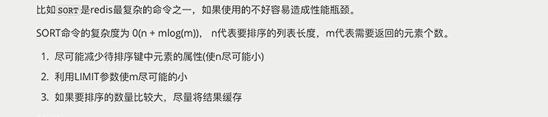
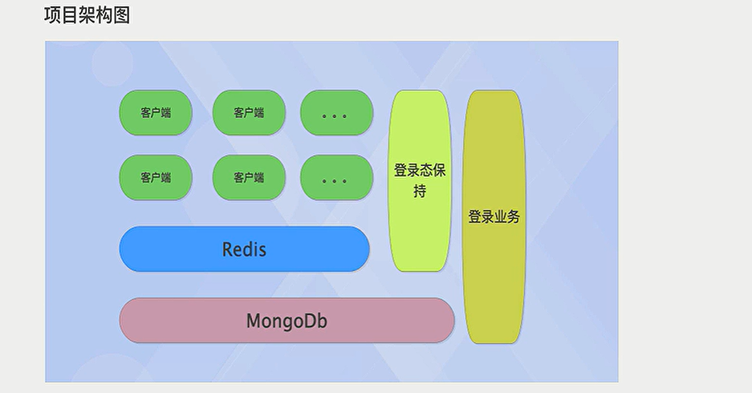

# 非关系型数据库

内存型：存在内存中，速度快，容量小。`Redis`,`Memcached数据库`

存储型：存在硬盘中，熟读满，容量大。`MongoDb`

应用于高并发，高速读写

## Redis

### 字符串

```
keys *
exist key
del key1 [key2 _]

set foo 1   //set key value,类型为string
append foo 2  //返回 ’12‘
type foo

incr num1   //自增，类型为integar
incrby num1 10  //增加10
incrbyfloat num1 0.3 //增加浮点数 0.5

decr num1  //自减1
decrby num1 10  //增加10

strlen num1  //获取长度，一个汉字为3

mset  num1 1 num2 2   /设置/获取多个值
mget  num1 num2  

gitbit num1 2 //第二位的值
```

### 散列结构：（类似于字典）

```
hset car:1 price 500
hmset car:1 name 宝马

hget car:1 name

hgetall car:1

hincrby car:1 price 10

hexists car:1 name

hdel car:1 price   //删除字段
```

### 列表结构：

有序的字符串列表

```
lpush numlist 1  //左边添加
rpush numlist 2

lpop numlist
rpop numlist

llen numlist   //获取元素个数

lrange numlist 0 1   // 0-1 闭区间的片段
lrange numlist 0 -1   // 显示全部

ltrin numlist 0 1  //只保留0-1闭区间的内容

lrem numlist 1 3    //从左往右删 ，删一个，把3删除

lindex numlist 1   //获取指定index对应的内容
lset numlist 1 3   //设置index对应的内容

linsert numlist after/before 2 1  //在值为2的元素前面或后面插入1

rpoplpush numlist1 numlist2  //从一个列表弹出，另一个列表插入
```

### 集合结构：

```
sadd numset a  //添加元素 a

srem numset a

smembers numset    //显示所有元素

sismember numset a   //查看是否在其中

sdiff numset1 numset2   //差集

sinter numset1 numset2   //交集

sunion numset1 numset2   //并集

sdiffstore storeset numset1 numset2   //获取差集并存储

scard numset  //元素个数

srandmember  numset 1  //随机获取1个不重复元素    负数表示可以重复
```

### 有序集合类型：

```
zadd zset 1 tom  //tom 元素分数1，按元素排序

zscore zset tom

zrange zset 0 1  withscore //返回范围内的元素，升序

zrevrange zset 0 1   //降序排序

zrangebyscore zset 80 (100   //左开右毕区间

zrangebyscore zset 80 +inf   //正无穷

zrangebyscore zset 80 +inf  limit 0 3 //正无穷，从0开始，返回前3个

zincrby zset 4 tom    //给tom 加 4分

zcard zset  //获取元素数量

zcount zset 80 100  //返回80 -100的数量

zrem zset tom   //删除元素

zremrangebyrank zset 0 2  //按照排名范围删除
zremrangebyscore zset 80 200  //按照分数范围删除

zrank zset tom   //获取排名
zrevrank

zinterstore setstore zset1 zset2 [weights 1 10 ] [aggregate min/max/sum]  //区交界，权重，合并规则，默认等权求和
```

### 事务操作：

```
multi

zcount zset 80 100  //返回80 -100的数量

exec  进行包裹，检查语法错误，不识别运行错误
```

### watch：

监视的键一旦被修改或删除，之后是事务不再执行

```
watch watch1

set watch1 2  //之后的事务不在执行 
```

### 过期时间：

```
expire session 800   //800秒后过期，自动删除

ttl session   //返回剩余过期时间  -1未设置过期时间（永久存在）  -2已过期

persist session  //永久存在
```

### 排序：

列表，有序集合（对元素本身排序，而不是值排序）

```
lpush numlist 1 2 4 6 2 3

sort  numlist 


sort numlist by port:*->times desc get port:*->name get #
```

### 性能



命名精简，节约存储空间


### node写法

npm i ioredis

```
const redis =require('ioredis')

const client = new redis()

client.set('node_test',1)


//管道的两种写法
const pipeline = client.pipeline()

pipeline.set('node_test','2').get('node_test').exec(function(err,result){})

client.pipeline([
    ['set','node_test2','1'],
    ['get','node_test2']
]).exec(function(err,result){console.log(result);})


//事务
client.multi().set('node_test','2').get('node_test').exec(function(err,result){})
```

## memcached

简洁的key-value系统，只有字符串一种格式

### API

1. **set**

Memcached set 命令用于将 **value(数据值)** 存储在指定的 **key(键)** 中。

如果set的key已经存在，该命令可以更新该key所对应的原来的数据，也就是实现更新的作用。

```shell
set key flags exptime bytes [noreply] 
value 
```

参数说明如下：

- **key：**键值 key-value 结构中的 key，用于查找缓存值。
- **flags**：可以包括键值对的整型参数，客户机使用它存储关于键值对的额外信息 。
- **exptime**：在缓存中保存键值对的时间长度（以秒为单位，0 表示永远）
- **bytes**：在缓存中存储的字节数
- **noreply（可选）**： 该参数告知服务器不需要返回数据
- **value**：存储的值（始终位于第二行）（可直接理解为key-value结构中的value）

```shell
set runoob 0 900 9
memcached
STORED

get runoob
VALUE runoob 0 9
memcached

```

如果数据添加成功，则输出：

```
STORED
```

2. **add**

Memcached add 命令用于将 **value(数据值)** 存储在指定的 **key(键)** 中。

如果 add 的 key 已经存在，则不会更新数据(过期的 key 会更新)，之前的值将仍然保持相同，并且您将获得响应 **NOT_STORED**。(说明只能存新值，没有修改功能)

```shell
add key flags exptime bytes [noreply]
value
```

参数说明如下：

- **key：**键值 key-value 结构中的 key，用于查找缓存值。
- **flags**：可以包括键值对的整型参数，客户机使用它存储关于键值对的额外信息 。
- **exptime**：在缓存中保存键值对的时间长度（以秒为单位，0 表示永远）
- **bytes**：在缓存中存储的字节数
- **noreply（可选）**： 该参数告知服务器不需要返回数据
- **value**：存储的值（始终位于第二行）（可直接理解为key-value结构中的value）

```shell
add new_key 0 900 10
data_value
STORED
get new_key
VALUE new_key 0 10
data_value
END
```

如果数据添加成功，则输出：

```
STORED
```

3. replace

Memcached replace 命令用于替换已存在的 **key(键)** 的 **value(数据值)**。

如果 key 不存在，则替换失败，并且您将获得响应 **NOT_STORED**。

```shell
replace key flags exptime bytes [noreply]
value
```

参数说明如下：

- **key：**键值 key-value 结构中的 key，用于查找缓存值。
- **flags**：可以包括键值对的整型参数，客户机使用它存储关于键值对的额外信息 。
- **exptime**：在缓存中保存键值对的时间长度（以秒为单位，0 表示永远）
- **bytes**：在缓存中存储的字节数
- **noreply（可选）**： 该参数告知服务器不需要返回数据
- **value**：存储的值（始终位于第二行）（可直接理解为key-value结构中的value）

```shell
add mykey 0 900 10
data_value
STORED
get mykey
VALUE mykey 0 10
data_value
END
replace mykey 0 900 16
some_other_value
get mykey
VALUE mykey 0 16
some_other_value
END
```

如果数据添加成功，则输出：

```
STORED
```

4. append

Memcached append 命令用于向已存在 **key(键)** 的 **value(数据值)** 后面追加数据 。

```shell
append key flags exptime bytes [noreply]
value
```

参数说明如下：

- **key：**键值 key-value 结构中的 key，用于查找缓存值。
- **flags**：可以包括键值对的整型参数，客户机使用它存储关于键值对的额外信息 。
- **exptime**：在缓存中保存键值对的时间长度（以秒为单位，0 表示永远）
- **bytes**：在缓存中存储的字节数
- **noreply（可选）**： 该参数告知服务器不需要返回数据
- **value**：存储的值（始终位于第二行）（可直接理解为key-value结构中的value）

```shell
set runoob 0 900 9
memcached
STORED
get runoob
VALUE runoob 0 9
memcached
END
append runoob 0 900 5
redis
STORED
get runoob
VALUE runoob 0 14
memcachedredis
END
```

如果数据添加成功，则输出：

```
STORED
```

5. prepend

Memcached prepend 命令用于向已存在 **key(键)** 的 **value(数据值)** 前面追加数据 。

```
prepend key flags exptime bytes [noreply]
value
```

参数说明如下：

- **key：**键值 key-value 结构中的 key，用于查找缓存值。
- **flags**：可以包括键值对的整型参数，客户机使用它存储关于键值对的额外信息 。
- **exptime**：在缓存中保存键值对的时间长度（以秒为单位，0 表示永远）
- **bytes**：在缓存中存储的字节数
- **noreply（可选）**： 该参数告知服务器不需要返回数据
- **value**：存储的值（始终位于第二行）（可直接理解为key-value结构中的value）

```shell
set runoob 0 900 9
memcached
STORED
get runoob
VALUE runoob 0 9
memcached
END
prepend runoob 0 900 5
redis
STORED
get runoob
VALUE runoob 0 14
redismemcached
END
```

如果数据添加成功，则输出：

```
STORED
```

## Mongodb

适合存储型，数据直接没什么关系

```
const MongoClient = require('mpngodb').MongoClient

const url = 'mongodb://localhost:27017'

const dname = 'myproject'

const client = new MongoClient(url)

client.connect(function (err) {

    const db = client.db(dname)   //创建数据库

    insertDocuments(db, function () {
        client.close()
    })

})


const insertDocuments = (db, callback) => {
    const collection = db.collection('documents')  //创建集合（数据库表）

    collection.insertMany([
        { a: 1, b: 2 }, { a: 2, b: 2 }
    ], function (err, result) {   //添加2条文档（数据）
        callback(result)
    })
}

const selectData = (db, callback) => {
    const collection = db.collection('documents')  //连接集合（数据库表）

    collection.find({ a: 1 })
        .toArray((err, result) => {   //查找
            callback(result)
        }
        )
}

const uodateData = (db, callback) => {
    const collection = db.collection('documents')  //连接集合（数据库表）

    collection.update({a:1},{$set:{b:1}},function(){   //先查询到，再更改
        callback()
    })
}

const delData = (db, callback) => {
    const collection = db.collection('documents')  //连接集合（数据库表）

    collection.remove({a:1},(err,data) => {
        callback()
    })
}
```

## egg+ redis + mongodb  实现登录流程

mongodb  作用类似MySQL 存储数据



cookie和session之间的关系就是米和粥的关系，没有cookie就没有session

token可以理解为加密过的用户名

### cookie维持登录流程

cookie只能存储4K数据

1. 浏览器第一次访问服务器（此时无cookie）
2. 用户将用户名和密码，通过request发送给服务器
3. 服务器收到请求，如果正确，通过response携带set-cookie，将cookie设置为 username=‘哈哈’，返回浏览器
4. 浏览器将cookie存在本地，之后发送请求自动携带cookie
5. 服务端利用cookie进行比较数据库，查询到用户，则通过

### session维持登录流程 

session能够存储对象，且大小不受限制

1. 用户输入名字，密码，通过request发送
2. 服务端校验通过，在response中设置cookie，username=’jack'  
3. 同时服务端，在数据库存储（`redis`）以jack为键（或者以`token`为键）的对象（购物车，权限，登陆状态等）
4. 浏览器再次登录，根据cookie中的jack查询信息,返回相应页面


### egg

egg egg-mongoose  egg-redis  egg-scripts egg-session egg-view-nunjucks
