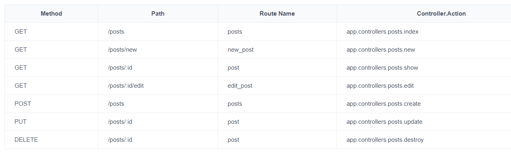
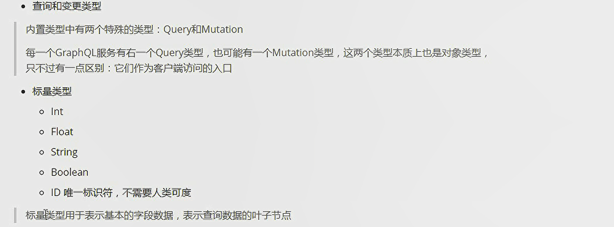
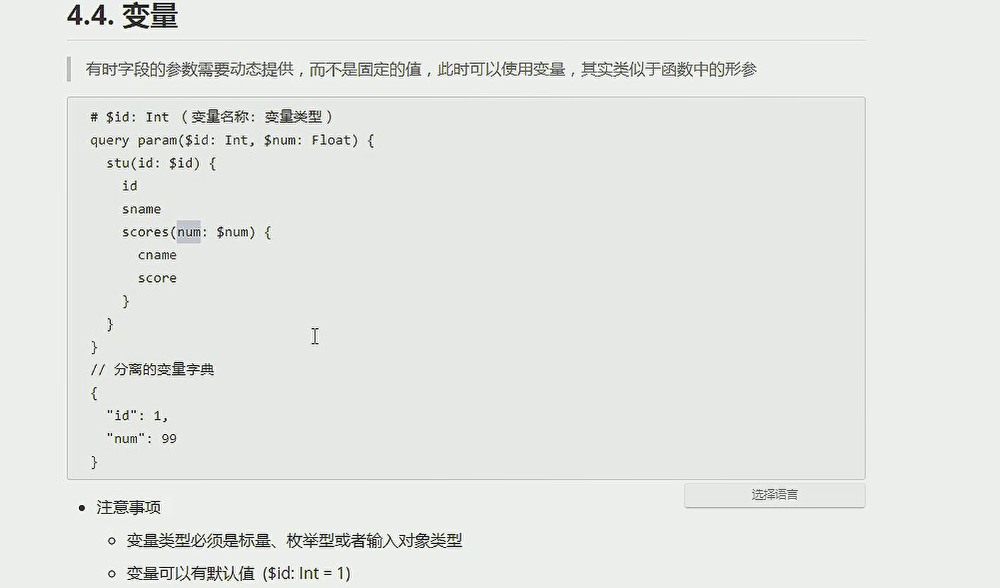
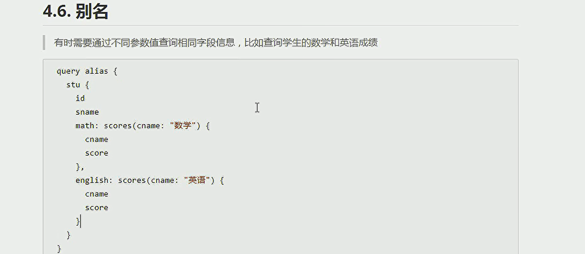
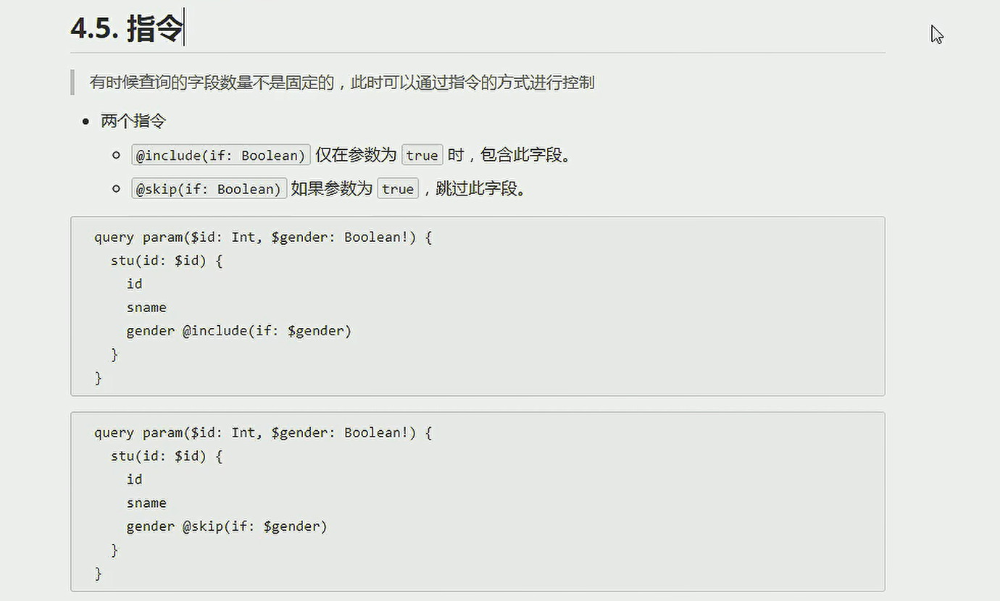

# koa

基于node.js的web框架，有express框架原开发人员打造

```
const koa = require('koa')
const route = require('koa-route')
const static = require('koa-static')
const path = require('path')


const app = new koa()


const main = (ctx) =>{
    if(ctx.request.accepts('html')){    //判断客户端希望接受类型
        ctx.response.type = 'html'
        ctx.response.body = '<h1>fdfdd</h1>'
    }else{
        ctx.response.body = 'fdfdd'  //默认类型text
    }
    
}


app.use(main)

const redirect = (ctx) =>{
    ctx.response.redirect = '/a'  //重定向,状态码302重定向
}


app.use(route.get('/',redirect))  //路由


app.use(static(path.join(__dirname,'/assist')))  //静态资源


app.listen(3000)  //监听端口3000
```


  ## 中间件

**洋葱模型**：

```
const logger = (ctx,next) =>{
	log(1)   //next前的代码，按照app.use的顺序执行
	next()
	log(2)   //next后的代码，按照app.use的相反顺序执行
}

app.use(logger)
```

**异步中间件**：

一个中间件异步，需要把所有中间件改为异步

```
const logger = async function(ctx,next){
	log(1)   //next前的代码，按照.use的顺序执行
	await next()
	log(2)   //next后的代码，按照.use的相反顺序执行
}  
```

**中间件合成**

借助koa-compose包

 compose函数，接受参数为函数，从右向左执行各个函数，初始函数可以接受多个参数，之后的函数只有一个参数

```
const fn = compose（two,one）

const one = (a,b) =>{return a+b}   //初始化函数，并返回值
const two = (c) =>{ return c*10}  //并返回值

fn(1,2)   
```

## 抛出错误

```
const main = (ctx) =>{
	ctx.throw(500)
}

const main = (ctx) =>{
	ctx.response.status(404)
	ctx.response.body('未找到')
}
```

错误处理中间件：

```
const errHandle = (ctx,next) =>{
	try{
		next()
	}catch(err){
		ctx.response.status = err.statusCode || err.status || 500;
		ctx.response.body = {
			message: err.message
		}
	}
}

app.use(errHandle)  //写在最前面
```

错误事件：

```
被catch后，不会触发该事件

app.on('error',err => {
	log(err)
})
```

## 文件上传

koa-body包处理post请求

```
const koa = require('koa')
const route = require('koa-route')
const { koaBody }  = require('koa-body')
const fs = require('fs')
const path = require('path')
const os = require('os')


const app = new koa()


const upload = (ctx, naxt) => {
    const tempdir = os.tmpdir()   //创建临时目录

    const filtsPath = []
    const files = ctx.request.files || {}

    for (const key in files) {
        const file = files[key]

        const reader = fs.createReadStream(file.filepath)
        const writer = fs.createWriteStream(path.join(tempdir, file.originalFilename))
        reader.pipe(writer)

        filtsPath.push(path.join(tempdir, file.originalFilename))
    }

    ctx.body = filtsPath
}


const main = (ctx, next) => {
    ctx.response.type ='html';
    ctx.response.body = '<form id="uploadForm" action="/upload" method="post" enctype="multipart/form-data">\
        <input type = "file" name = "myFile" />\
            <button type="submit">Upload</button>\
            </form > '
}


app.use(koaBody({ multipart: true }))
app.use(route.get('/',main))
app.use(route.post('/upload',upload))

app.listen(3000) 
```

# egg

[官网](https://www.eggjs.org/zh-CN/basics/structure)


阿里基于koa的web框架

写插件，根据业务封装自己的框架，约定优于配置

脚手架

```
npm init egg --type=simple
npm i
```

## 静态文件


## 控制层

```
const { Controller } = require('egg');

class HomeController extends Controller {
  async templist() {
    const { ctx } = this;
    await ctx.render('demo.nj');
    // ctx.helper.getData();
  }
}

module.exports = HomeController;
```


## 扩展

给ctx扩展方法

```
// extend 类似于util

exports.getData = () => {
  return '工具';
};
```

模板中使用：<h1>你好 {{helper.getData()}}</h1>

控制层使用：ctx.helper.getData();

## 中间件

```
module.exports = (options, app) => {
  return async function(ctx, next) {
    console.log('日志');
    await next();
  };
};

```

```
  config文件
  // add your middleware config here
  config.middleware = [
    'log',
  ];
```


## 模板引擎

npm i egg-view-nunjucks --save

写到app/view 文件夹下

demo.nj

```
<html>
    <head>
        <title>标题</title>
    </head>
    <body>
        <h1>你好 {{helper.getData()}}</h1>
    </body>

</html>
```

## 路由文件

```
/**
 * @param {Egg.Application} app - egg application
 */
module.exports = app => {
  const { router, controller } = app;
  router.get('/', controller.home.index);
  router.get('/list', controller.home.templist);
};
```

## debug

  "debug":"egg-bin debug", 

## 进程通信

相比与node原生的进程通信，增加了agent管理

```
// app.js
module.exports = (app) => {
  // 只有在 egg-ready 事件后才能发送消息
  app.messenger.once('egg-ready', () => {
    app.messenger.sendToAgent('agent-event', { foo: 'bar' });  //只向 agent发送
    app.messenger.sendToApp('app-event', { foo: 'bar' });  //向所有发送
  });
};
```

## 捕获异常

try-catch

**为确保异常可追踪，所有抛出的异常必须是 `Error` 类型，因为只有 `Error` 类型才具备堆栈信息，便于问题定位。**

```js
//跳出异步链的函数异常不会被捕获，需要runInBackground

his.ctx.runInBackground(async () => {        
      // 这里的异常都会被 Background 捕获，并打印错误日志
      await this.ctx.service.trade.check(request);
    });
```

## 404

```
router.get('/404', controller.home.templist);
  
  
  //404自动重定向
 config.notfound = {
    pageUrl: '/404',
  };
```

## egg-mongoose插件

app/modle/ports.js

```
// 该文件表示对应了存储的表为posts

module.exports = app => {
  const mongoose = app.mongoose;

  //定义集合结构
  const postSchema = new mongoose.Schema({
    title: {
      type: String,
      required: true,
      unique: true, // email 必须是唯一的
    },
    content: { type: String },
  });

  //ctx 上可以直接调用 model类 Posts
  return mongoose.model('Posts', postSchema);
};

```
//routes.js

```

/**
 * @param {Egg.Application} app - egg application
 */
 
module.exports = app => {
  const { router, controller } = app;
  router.get('/', controller.home.index);
 
  router.get('/404', controller.home.templist);

  router.resources('posts', '/api/posts', controller.posts);   //定义restful风格接口
};

```
//app/control/ports.js
```

const { Controller } = require('egg');

class HomeController extends Controller {

	async create() {
        try {
            const { ctx, app } = this;
            console.log(ctx.request.body);
            // ctx.validate({ title: 'string' }, ctx.request.body);
            // const postsInstance = ctx.model.Posts({  //自动改为驼峰制
            //     title: ctx.request.body.title,
            //     content: ctx.request.body.content,
            // });
            // const res = await postsInstance.save();

            const res = await ctx.service.posts.create(ctx.request.body);  //service抽离
            this.success(res);
        } catch (error) {
            this.fail(error);
        }
    }
    
	//查全部
    async index() {

        try {
            const { ctx } = this;
            console.log(ctx.body);
            const res = await ctx.model.Posts.find({});
            this.success(res);
        } catch (error) {
            this.fail(error);
        }


    }
	//查单个
    async show() {
        try {
            const { ctx } = this;
            console.log(ctx.params.id);

            const res = await ctx.model.Posts.find({ _id: ctx.params.id });
            this.success(res);
        } catch (error) {
            this.fail(error);
        }
    }
    
    async update() {
        try {
            const { ctx } = this;
            console.log(ctx.params.id);
            // localhost:7001/api/posts/123455
            const res = await ctx.model.Posts.update({ _id: ctx.params.id }, {
                $set: {
                    ...ctx.request.body,
                }
            });
            this.success(res);
        } catch (error) {
            this.fail(error);
        }

    }
    
    async destroy() {
        try {
            const { ctx } = this;
            console.log(ctx.params.id);
            // localhost:7001/api/posts/123455
            const res = await ctx.model.Posts.remove({ _id: ctx.params.id });
            this.success(res);
        } catch (error) {
            this.fail(error);
        }
    }


    async success(data) {
        this.ctx.body = {
            msg: data && data.msg || 'ok',
            code: 0,
            data,
        };
    }

    async fail(data) {
        this.ctx.body = {
            msg: data && data.msg || 'fail',
            code: data && data.code || 0,
            data,
        };
    }

}

module.exports = HomeController;


```

利用service抽离业务，使得control只负责处理http响应和请求

//app/service/ports.js

```


const Service = require('egg').Service;

class PostsService extends Service {

    async create(data) {

        const { ctx, app } = this;

        ctx.validate({ title: 'string' }, data);
        const postsInstance = new ctx.model.Posts({  // 自动改为驼峰制
            title: data.title,
            content: data.content,
        });


        const res = await postsInstance.save();

        return res;

    }

}


module.exports = PostsService;


```

# 接口开发方式


## Restful



接口定义粒度细，需要多个请求才能完成一个业务

## GraphQL

按需返回请求字段内容

一个请求获取多个资源

### 数据类型



枚举类型

enum Char {
	a
	b
}

列表类型

[]

[]!，string！ 表示非空   [string！]!表示元素和列表均非空

### 输入类型

主要涉及数据变更操作，mutation场景(需要客户端传入数据)

```
# 客户端默认查询类型query，服务端必须有且唯一
extend type Query {
    articleList(first: ID): [Article]
    a(first: String = "ff"): String      
}


#客户端默认的变更类型，服务端必须要且唯一
extend type Mutation {
    addArticle(title: String, content: String, author: AddAuthor): Article
}

input AddAuthor {
    name: String
    age: Int
}
```

```
操作：
mutation {
  addArticle(title: "title", content: "content", author: {name: "张三", age: 15}){
    title
    content
    id
  }
}
```


### 服务端egg-apollo-server

npm i egg-apollo-server --save

```
//plugin.js
graphql: {
    enable: true,
    package: 'egg-apollo-server',
  },
```

```
  //config.default.js
  
  config.graphql = {
    router: '/graphql',
    app: true, // 是否加载到 app 上,默认为 true
    agent: false, // 是否加载到 agent 上,默认为 false
    graphiql: true, // 是否加载开发者工具 playground,默认为 true
    uploads: true, // 是否开启文件上传功能，默认开启

    // 是否添加默认的type Query,Mutation,默认为true
    // 如果为true须使用extend type Query|extend type Mutation,因为graphql规定同一个type只能定义一个
    // 带来的好处时egg/graphql下不用再新建query,mutation目录
    defaultEmptySchema: true,

    // subscriptions的值为<Object>|<String>|false 见https://www.apollographql.com/docs/apollo-server/api/apollo-server/
    // 如果为String 表示订阅的路径
    // 如果为false 关闭订阅
    // 如果为object 可以添加path,keepAlive,onConnect,onDisconnect
    subscriptions: false,
    // subscriptions: {

    //   onConnect: (connectionParams, webSocket) => {
    //     console.log('connect');
    //     if (connectionParams.authToken) {
    //       // return validateToken(connectionParams.authToken)
    //       //   .then(findUser(connectionParams.authToken))
    //       //   .then(user => {
    //       //     return {
    //       //       currentUser: user,
    //       //     }
    //       //   })
    //     }

    //     // throw new Error('Missing auth token!')
    //   },
    // },
    // 可选字段,接受项目中发生的错误,然后自定义错误返回给前端
    formatError: (error, app) => {
      // console.log(error);
      app.logger.error(error);
      return error;
    },
    debug: false, // 发生错误时,是否包含错误堆栈信息,生产环境要设置为false
  };
  
  
  //同时需要csrf设置为false，graphql需要跳过验证
  config.security = {
    csrf: {
      enable: false,       // 测试graphql时，需要关闭
      queryName: '_csrf', // 通过 query 传递 CSRF token 的默认字段为 _csrf
      bodyName: '_csrf', // 通过 body 传递 CSRF token 的默认字段为 _csrf
    },
  
```

同时在app文件夹下，建立graphql文件夹

对应业务下必须有两个文件，resolver.js和schema.graphql文件

schema.graphql负责定义数据结构

```
//app/graphql/artical/schema.graphql
#本文件，定义结构

#插件设置了默认的Query,Mutation 所以不用定义Query,直接使用extend继承
# 客户端默认查询类型query，服务端必须有且唯一
extend type Query {
	#使用{articleList（）{id,name}}  指定返回的属性
    articleList(first: ID): [Article]
    #返回为单一属性时,{a()};使用默认参数时，{a}
    a(first: String = "ff"): String      
}


#客户端默认的变更类型，服务端必须要且唯一
extend type Mutation {
    addArticle(title: String, content: String, author: AddAuthor): Article
}

type Article {
    id: ID
    title: String
    content: String
    author: Author
    find(name:String) : Author
}
type Author {
    name: String
    age: Int
}

input AddArticle {
    title: String
    content: String
}

input AddAuthor {
    name: String
    age: Int
}

```


resolver.js负责为对应结构赋予真是返回值

```
//app/graphql/artical/resolver.js
'use strict';
// 本文件为结构赋予具体的值


const list = [
  {
    id: 1,
    content: 'aaa',
    title: '',
    author: {
      name: 'aaa',
      age: 18,
    },
  },
  {
    id: 2,
    content: 'bbb',
    title: '',
    author: {
      name: 'aaa',
      age: 18,
    },
  },
];

// 数据类型对应的数据
module.exports = {

  // 查询
  Query: {
  	Article: {
  		name:(parent) =>{
  			parent.name
  		}
  	}
    articleList: (root, params) => {
      console.log(params);
        list;
    },
    a: (root, params) => {
      console.log(params);
      return params.first + '3';
    },

  },

  // 新增
  Mutation: {
  	//root表示上级对象
  	//ctx用于对接数据源（数据库，文件，第三方接口）
  	
    addArticle(root, params, ctx，info) {
      console.log(params);
      params.id = list.length++;
      list.push(params);
      return params;
    },
  },
};


```

### 客户端规则

```
query anothername {       //可以起别名 anothername。同时多个操作 需要起别名
  articleList(first: 0){
    id
    author{
	  name
      age
    }
  }
}


mutation {
  addArticle(title: "title", content: "content", author: {name: "张三", age: 15}){
    title
    content
    id
  }
}
```







`指令变量末尾必须添加  ！`

### 客户端调用接口

client进行配置，直接利用官网中间件，调用query,mutation
