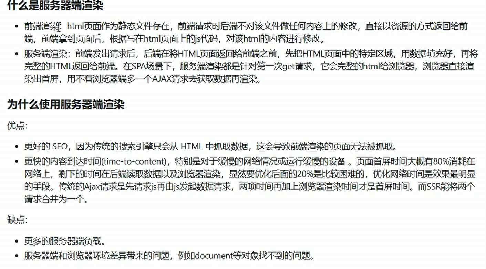

# 服务端渲染SSR



适用于交互性小的页面，如新闻

## node后端框架(koa) 与 服务端渲染框架（mext.js）的区别

两者都可以做服务端渲染，

两者在做前后端分离时：node后端框架做api服务器，服务端渲染框架做web页面服务器

## Nuxt.js

基于vue的通用框架，可以服务端渲染，spa应用，静态化预渲染（将vue页面生成html页面）

```
npm i create-nuxt-app -g

create-nuxt-app demo

cd demo

npm run dev
```

不需要单独配置路由，根据pages文件自动生成路由

### 组件库

nuxt3引入element-plus

```
npm install element-plus --save
npm install @element-plus/nuxt --save-dev
```

```
// nuxt.config.ts
export default defineNuxtConfig({
  modules: [
    '@element-plus/nuxt'
  ],
  css: [
    'element-plus/dist/index.css'
  ],      //全局样式
})
```

```
<template>
  <el-button>Click me</el-button>
</template>

<script setup lang="ts">
import { ElButton } from 'element-plus';
</script>
```


### SEO优化

 ```
 单个页面
 useHead({
   title: "我的应用",
   meta: [{ name: "description", content: "我的神奇网站。" }],
   bodyAttrs: {
     class: "test",
   },
   script: [{ innerHTML: "console.log('Hello world')" }],
 });
 ```

```
全局配置 nuxt-config.js
export default defineNuxtConfig({
  compatibilityDate: '2024-04-03',
  devtools: { enabled: false },
  modules: [
    '@element-plus/nuxt'
  ],
  css: ['element-plus/dist/index.css'],
  app: {
    head: {
      title:'sdfsdf',
      charset: 'utf-8',
      viewport: 'width=device-width, initial-scale=1',
    }
  }
})

```


## Next.js

1. **客户端组件**：
   - 完全在浏览器中渲染。
   - 通常用于构建用户界面，并且只有在浏览器加载了 JavaScript 代码后才能显示。
   - 可以访问浏览器的 API，如 `window` 和 `document` 对象。
   - 适用于需要交互或动态更新 UI 的场景。
2. **服务端组件**：
   - 在服务器上渲染，然后将生成的 HTML 发送到浏览器。
   - 可以在页面加载时就提供完整的 HTML，有助于改善 SEO 和初始加载性能。
   - 不能直接访问浏览器的 API，因为它们在服务器上运行。
   - 适用于静态内容或不依赖于浏览器 API 的内容，以及需要预渲染的页面。


服务端渲染可以提高首屏加载速度和 SEO，而客户端渲染则适用于需要实时交互和动态内容的场景。

## 页面

版本13之前，使用pages目录自动生成路由

13及之后，使用app-route方式，在app文件夹下定义包含page.js的目录自动生成路由
