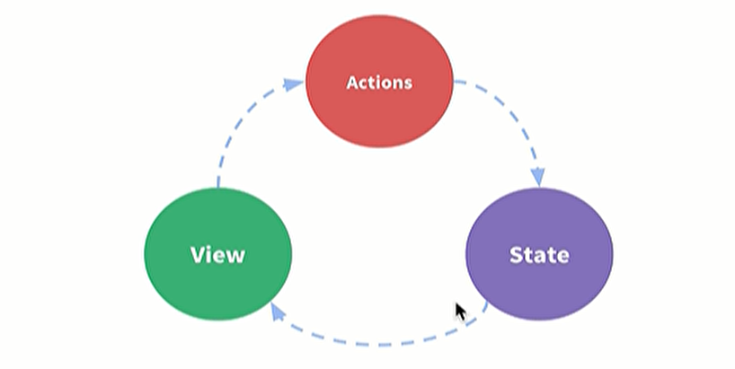

# vuex

`全局统一管理状态`

单组件-单向数据流



- state，驱动应用是数据源。
- view，以声明的方式将state映射到视图。
- actions，响应view上的用户输入导致的状态变化。

```
new vue ({
  //state
  data() {
    return {
      count: 0
    }
  },
  
  //action
  methods: {
    increment() {
      this.count++
    }
  },
  //view
  template: `
  	<div>{{count}}<div>
  `  
})
```

## 核心概念

state:状态数据，不要在组件中直接修改状态

getter:类似计算属性

mutation ：类似事件，只能处理同步函数，接受state

action : 提交的是 mutation，而不是直接变更状态, 可以包含任意异步操作。

module : 模块化管理

```
const moduleA = {
  state: {
    todos: [
      { id: 1, text: '...', done: true },
      { id: 2, text: '...', done: false }
    ]
  },              //this.$store.state.count
  
  
  getters: {
    doneTodos (state) {
      return state.todos.filter(todo => todo.done)
    }
  },            //this.$store.getters.doneTodos 
  
  
  mutations: {
    increment (state,n) {
      // 变更状态
      state.count++
    }
  },            //this.$store.commit('increment', 10)
  
  
  actions: {
    increment (context) {
      context.commit('increment')
    }
  }
};             //this.$store.dispatch('increment')

const store = createStore({
  modules: {
    a: moduleA,
    b: moduleB
  }
})          //this.$store.state.a.count
```
## state,，getter挂载到计算属性上

```

import { mapState } from 'vuex'
import { mapGetters } from 'vuex'
export default {
  computed: {
    ...mapState([
  // 映射 this.count 为 store.state.count
      'count'
    ])，
  // 使用对象展开运算符将 getter 混入 computed 对象中
    ...mapGetters([
      'doneTodosCount',
      'anotherGetter',
      // ...
    ])
  }
}

```
## mutation，action 挂载到事件上

```

import { mapMutations } from 'vuex'
import { mapActions } from 'vuex'


export default {

  methods: {
    ...mapMutations([
      'increment', // 将 `this.increment()` 映射为 `this.$store.commit('increment')`

      // `mapMutations` 也支持载荷：
      'incrementBy' // 将 `this.incrementBy(amount)` 映射为this.$store.commit('incrementBy', amount)`
    ]),
    ...mapMutations({
      add: 'increment' // 将 `this.add()` 映射为 `this.$store.commit('increment')`
    }),
    
    
    
     ...mapActions({
      add: 'increment' // 将 `this.add()` 映射为 `this.$store.dispatch('increment')`
    })
  }
}

```

## module，默认绑定到全局空间

mutation、action、getter默认全局，state是局部的

```

namespaced: true,   局部命名空间

root: true,   命名空间注册全局空间action

modules: {
  foo: {
    namespaced: true,

    getters: {
      // 在这个模块的 getter 中，`getters` 被局部化了
      // 你可以使用 getter 的第四个参数来调用 `rootGetters`     命名口昂加调用全局属性
      someGetter (state, getters, rootState, rootGetters) {
        getters.someOtherGetter // -> 'foo/someOtherGetter'
        rootGetters.someOtherGetter // -> 'someOtherGetter'
        rootGetters['bar/someOtherGetter'] // -> 'bar/someOtherGetter'
      },
      someOtherGetter: state => { ... }
    },
    
    
     actions: {
        someAction: {
          root: true,
          handler (namespacedContext, payload) { ... } // -> 'someAction'
        }
    }，
  }
}
```

```
computed: {
  ...mapState('some/nested/module', {
    a: state => state.a,
    b: state => state.b
  }),
  ...mapGetters('some/nested/module', [
    'someGetter', // -> this.someGetter
    'someOtherGetter', // -> this.someOtherGetter
  ])
},
methods: {
  ...mapActions('some/nested/module', [
    'foo', // -> this.foo()
    'bar' // -> this.bar()
  ])
}

或者处理单一局部空间时
import { createNamespacedHelpers } from 'vuex'

const { mapState, mapActions } = createNamespacedHelpers('some/nested/module')

export default {
  computed: {
    // 在 `some/nested/module` 中查找
    ...mapState({
      a: state => state.a,
      b: state => state.b
    })
  },
  methods: {
    // 在 `some/nested/module` 中查找
    ...mapActions([
      'foo',
      'bar'
    ])
  }
}
```

## 严格模式

只允许在mutation中修改状态

# Redux

## 设计思想

所有状态都保存在一个对象中。

视图与状态一一对应。

```
npm install @reduxjs/toolkit react-redux -s
```

Redux Toolkit是Redux 简化版工具包，简化了大多数 Redux 任务

React-Redux 钩子让 React 组件与 Redux 存储交互。我们可以使用 `useSelector` 从存储中读取数据，并使用 `useDispatch` 调度操作。

## 基础写法

- 创建切片

  ```
  import { createSlice } from '@reduxjs/toolkit'
  
  
  // 创建 Redux 状态切片
  export const counterSlice = createSlice({
    name: 'counter',
    initialState: {
      value: 0
    },
    reducers: {
      increment: state => {
        // Redux Toolkit allows us to write "mutating" logic in reducers. It
        // doesn't actually mutate the state because it uses the Immer library,
        // which detects changes to a "draft state" and produces a brand new
        // immutable state based off those changes
        state.value += 1
      },
      decrement: state => {
        state.value -= 1
      },
      incrementByAmount: (state, action) => {
        state.value += action.payload
      }
    }
  })
  
  // Action creators are generated for each case reducer function
  export const { increment, decrement, incrementByAmount } = counterSlice.actions
  
  export default counterSlice.reducer
  ```

  

- 创建仓库

```
import { configureStore } from '@reduxjs/toolkit'
import counterReducer from './counterSlice'

export default configureStore({
  reducer: {
    counter: counterReducer
  }
})
```


- 在组件中使用

  ```
  import React from 'react'
  import { useSelector, useDispatch } from 'react-redux'
  import { decrement, increment } from '../store/counterSlice'
  
  
  const One =  function Counter() {
    const count = useSelector(state => state.counter.value)
    const dispatch = useDispatch()
  
    return (
      <div>
        <div>
          <button
            aria-label="Increment value"
            onClick={() => dispatch(increment())}
          >
            Increment
          </button>
          <span>{count}</span>
          <button
            aria-label="Decrement value"
            onClick={() => dispatch(decrement())}
          >
            Decrement
          </button>
        </div>
      </div>
    )
  }
  
  export default One;
  ```

  

最外部组件需要用provide包裹

```
function App() {
  return (
    <Provider store={store}>
      <One />
    </Provider>

  );
}
```


## react-redux

老版本中区分数据容器组件和ui组件，两者进行connect连接，相对独立

新版中使用钩子函数，不在区分

## 异步处理

createAsyncThunk API 会生成 thunk，自动为你分派这些 "开始/成功/失败" 操作。

```
import { createSlice, nanoid, createAsyncThunk } from '@reduxjs/toolkit'

export const fetchPosts = createAsyncThunk('posts/fetchPosts', async (id) => {
  const response = await client.get('/fakeApi/posts/:id')
  return response.data        //发送异步请求
})


const initialState = {
  posts: [],
  status: 'idle',
  error: null
}


const postsSlice = createSlice({
  name: 'posts',
  initialState,
  reducers: {
    // omit existing reducers here
  },
  extraReducers(builder) {         //用于监听自动生成的调度
    builder
      .addCase(fetchPosts.pending, (state, action) => {
        state.status = 'loading'
      })
      .addCase(fetchPosts.fulfilled, (state, action) => {
        state.status = 'succeeded'
        // Add any fetched posts to the array
        state.posts = state.posts.concat(action.payload)
      })
      .addCase(fetchPosts.rejected, (state, action) => {
        state.status = 'failed'
        state.error = action.error.message
      })
  }
})
```

异步操作开始时，自动调度 'posts/fetchPosts/pending'操作类型

完成后，自动调度 'posts/fetchPosts/fulfilled'操作类型，返回结果作为payload传入

```
//具体使用：

import React, { useEffect } from 'react'
import { useSelector, useDispatch } from 'react-redux'
// omit other imports
import { selectAllPosts, fetchPosts } from './postsSlice'

export const PostsList = () => {
  const dispatch = useDispatch()
  const posts = useSelector(selectAllPosts)

  const postStatus = useSelector(state => state.posts.status)

  useEffect(() => {
    if (postStatus === 'idle') {
      dispatch(fetchPosts(2))
    }
  }, [postStatus, dispatch])

  // omit rendering logic
}
```

# Mobx

状态管理库，一般与react结合使用，也可以和vue,angular结合

## 函数式

observable包裹的数组，对象，集合会被克隆为观察状态，

autorun，对涉及到的观察状态，如果输出结果变化时自动运行

action,负责更新state，`action.bound`表示this始终绑定在函数内部

```
import { observable, autorun } from "mobx"

const todos = observable([
    { title: "Spoil tea", completed: true,value:2 },
    { title: "Make coffee", completed: false ,value:1}
])

const increment = action(state => {
    state[0].value++
}

autorun(() => {
    console.log(
        "Remaining:",
        todos
            .filter(todo => !todo.completed)
            .map(todo => todo.title)
            .join(", ")
    )
})

todos[0].completed = false
// 打印: 'Remaining: Spoil tea, Make coffee'

increment(todos)
```

autorun,when,reaction都是监视数据的方式

## 类式

makeAutoObservable会自动包装action类型，computed类型和observable类型

observer包裹的组件，则是利用了上面的autorun和observable，进行了组件和状态的绑定，自动更新

```
import React from "react"
import ReactDOM from "react-dom"
import { makeAutoObservable } from "mobx"
import { observer } from "mobx-react-lite"

// 对应用状态进行建模。
export class Timer {
    secondsPassed = 0

    constructor() {
        makeAutoObservable(this)
    }

    increase() {
        this.secondsPassed += 1
    }

    reset() {
        this.secondsPassed = 0
    }
}


// 构建一个使用 observable 状态的“用户界面”。
const TimerView = observer(({ timer }) => (
    <button onClick={() => timer.reset()}>已过秒数：{timer.secondsPassed}</button>
))


export default TimerView;
```

```
const myTimer = new Timer();
// 每秒更新一次‘已过秒数：X’中的文本。
setInterval(() => {
  myTimer.increase()
}, 1000)


const myTimer2 = new Timer();


function App() {
  return (
    <Provider store={store}>
      <Two  timer = {myTimer}/>
      <Two  timer = {myTimer2}/>
    </Provider>

  );
}
```

