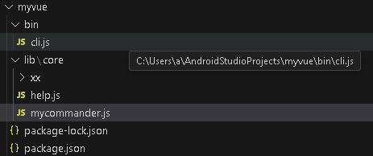

```
mkdir my-scaffold
cd my-scaffold

新建 bin/cli.js

npm init

npm install commander fs-extra
npm i chalk@4 inquirer@5 download-git-repo

npm link


```
```
10. 发布脚手架（可选）
如需分享脚手架，可发布到npm：

bash
复制
npm publish
发布后，其他人可通过npm install -g my-scaffold安装并使用。
```

```
myvue -h
```



cli.js
```
#! /usr/bin/env node


const { Command } = require('commander');
const helpfun = require('../lib/core/help');    
const mycommand = require('../lib/core/mycommander');

const program = new Command();

console.log('start');


helpfun(program);

mycommand(program);


program.parse(process.argv);   //解析参数
```
help.js
```
const helpfun = function(program){
    program.option('-f --frame <frame>', '设置框架');
};

module.exports = helpfun
```
mycommander.js
```
const inquirer = require('inquirer');
const download = require('download-git-repo');
const ora = require('ora');
const chalk = require('chalk');
const fs = require('fs-extra');
const path = require('path');

const prompt = inquirer.createPromptModule();

const mycommand =  (program) => {
    program
        .command('create <project> [other...]')
        .description('创建项目')
        .alias('crt')
        .action((project, args) => {
            console.log('project', project);
            console.log('args', args);

            // 交互式问答
            prompt([
                {
                    type: 'input',
                    name: 'name',
                    message: '请输入你的名字'
                },
                {
                    type: 'list',
                    name: 'framework',
                    message: '请选择你的框架',
                    choices: ['vue', 'react', 'angular']
                }
            ]).then((answers) => {
                console.log(answers);
                // 等待提示
                const spinner = ora().start();
                spinner.text = '代码正在下载...';
                // 下载仓库代码
                // const projectPath = path.join(process.cwd(), project);
                // console.log(projectPath);
                download('VG-cat/deploymentStudy', `./${project}`, { clone: true }, function (err) {
                    // console.log(err ? 'Error' : 'Success')
                    err ? spinner.fail(chalk.red('Error')) : spinner.succeed(chalk.green('Success'));
                    console.log('run');

                });
            });
        });
};

module.exports = mycommand
```
package.json
```
{
  "name": "myvue",
  "version": "1.0.0",
  "main": "index.js",
  "bin": {
    "myvue": "bin/cli.js"
  },
  "scripts": {
    "test": "echo \"Error: no test specified\" && exit 1"
  },
  "author": "",
  "license": "ISC",
  "description": "",
  "dependencies": {
    "chalk": "^4.1.2",
    "commander": "^13.1.0",
    "download-git-repo": "^3.0.2",
    "fs-extra": "^11.3.0",
    "inquirer": "^12.4.2",
    "ora": "^5.4.1"
  }
}

```

