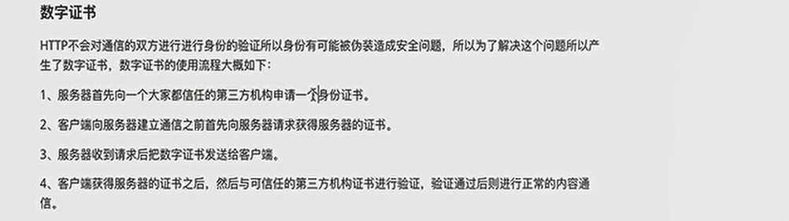
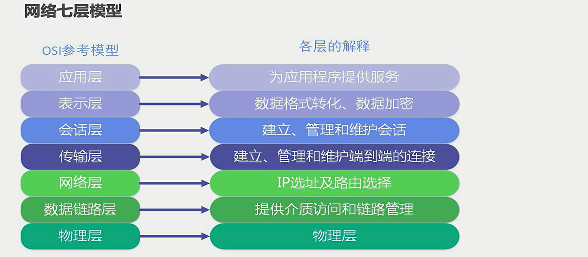
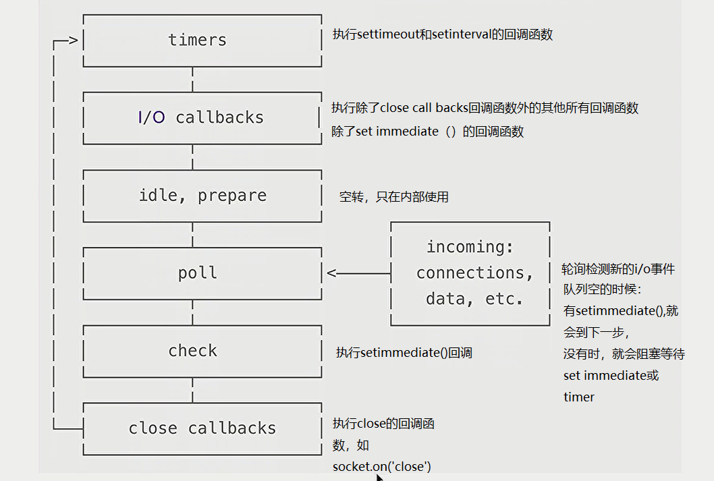
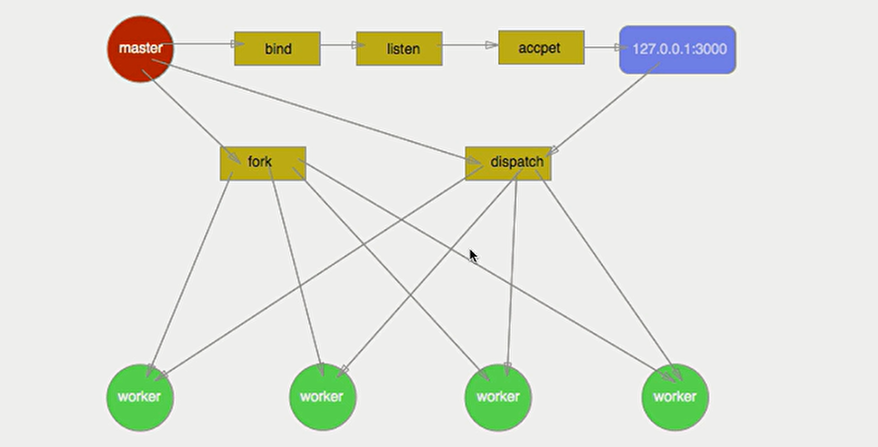

##  简介

node.js 是一个基于V8引擎的js运行环境，对应后端

浏览器也是一个运行环境，对应前端


## fs文件模块

fs模块的node.js官方提供发用于操作文件的模块

### 加载
const fs = require('fs')

### fs.readFile() 读取文件


```
fs.readFile('./test.txt','utf8',function(err,datastr){
    console.log('读取文件');
    console.log(err);    //null  || 信息
    console.log(datastr);  //undifine || 信息
})   //异步读取

fs.readFileSync("1.txt")   //返回buffer类型
```

### fs.writeFile() 写入文件

不会创建新文件，重复写入会覆盖内容


```javascript
fs.writeFile('./test.txt','型写入内容',function(err){
    console.log('写入文件');
    console.log(err);
})    //异步写入


fs.writeFileSync('./a.txt','12344')
```

### 路径拼接问题

当文件中出现相对路径时，./  ../，会自动拼接node命令执行所处的目录，可能出现路径错误

解决：
 \_\_dirname:表示当前文件所处的目录
 fs.readFile(\_\_dirname+'/test.txt'）

### open 和 createReadStream

```
const fd = await open('./a.txt');
// Create a stream from some character device.
const stream = fd.createReadStream();

stream.on('open',(err,data)=>{
	
})
stream.on('start',(err,data)=>{
	
})
stream.on('ready',(err,data)=>{
	
})
stream.on('ready',(err,data)=>{
	
})
stream.on('close',(err,data)=>{
	
})
```


## path路径模块
由官方提供的路径处理模块

### 加载

const path = require('path')

### path.join() 路径拼接

拼接过程中  ../  会抵消一层路径


### path.basename() 获取文件名


### path.extname() 获取扩展名

const  str  =  path.extname('a/c/a.txt')    //  返回    .txt

## http服务器模块
官方提供的，用来创建web服务器的模块，将普通电脑变成web服务器，向外提供资源

区别是：web服务器上安装了web服务器软件：lls，apache等，普通电脑没有

### 加载
const http = require('http')

### 创建与启动

//创建实例
const server = http.createServer()

//绑定request事件，监听客户端请求

```
server.on('request', function (req, res) {

    //req是请求对象，包括url,method
    //res是响应对象，向客户端返回指定信息
    
    console.log(req.url);
    res.end('霓虹')

})

```

//启动服务器，端口777
server.listen(777,function(){
    console.log('启动start');
})


### 中文乱码

向客户端返回中文乱码
 res.setHeader('Content-Type','text/html;charset=utf-8')
 res.end('霓虹 ')

### 返回html页面

读取发送

```
	res.setHeader('Content-Type','text/html;charset=utf-8')


	fs.readFile(path.join(__dirname,req.url),function(err,datastr){
        if(err){
            // res.end(err)
            res.end('<h1>404  no found </h1>')
        }else{
            res.end(datastr)
        }
    })

```
## https

对称加密：客户端和服务端密钥为同一密钥，可以对同一条数据进行加密和解密

非对称加密：两端使用不同的密钥，对同一条数据只能加密，或者解密


https对数据进行对称加密，对对称加密的密钥采用非对称加密传输

客户端产生随机密钥进行数据加密，服务端利用公钥和私钥进行加密随机密钥


数字证书验证服务器是真实的



数字签名验证服务器返回数据是否完整，是否被进行了篡改

## 模块化


### 加载模块

require('http')    // 加载内置模块
require('/a.txt')   //自定义
require('./selfDefine')    //第三方模块，必须要./或 ../开头

加载模块时，自动执行被加载模块里的代码

加载模块优先从缓存中加载
其他模块和内置模块重名时，只认内置模块


### module对象

在每一个.js自定义模块中，都有一个module对象，里面存储了和当前模块有关的信息

console.log(module)

#### module.exports对象

通过该对象可以将模块内的成员向外共享出去

外部通过require（）方法导入模块时，得到的是exports指向的对象

module.exports = {age：30}

### exports对象

是module.exports的简化写法
两者同时存在时，以module.exports指向的对象为准

exports = {age:22}
exoprt.age = 33

### 模块化规范

node.js遵循CommonJS模块化规范


## 包

node.js中第三方模块也叫做包

### npm

下载包
npm i moment@2.22.7

### 配置文件 package.json

在项目根目录里，记录与项目有关的一些配置信息

npm init -y    //快速创建package.json文件

npm install   //一次性安装package中的所有包

#### devDependencies节点


将包记录到devDependencies节点中
npm i moment -D     //简写方式
npm i moment --save-dev

### 更换下包镜像源
由国外改为国内的
npm config get registry   //查看当前的镜像源

npm config set registry=https://wwww.000000   //设置镜像源

#### nrm工具
用于切换镜像源的工具，提供终端命令

npm i nrm -g   //安装全局工具

nrm ls   //查看可用列表

nrm use taobao   //切换

### 发布包

npm publish  aaa
npm unpublish aaa --force     //72小时内可以删，超时永远存在

## node核心api

### 二进制数组

`Buffer` 对象用于表示固定长度的字节序列。

ArrayBuffer对象：代表原始的二进制数据，不能直接读写 

TypeArray视图：用于读写简单类型的二进制数据

DataView视图：用于读写复杂类型的二进制数据

```

const str = 'hello world'  //一个字符两个字节

function str2ab(str){
	let buf = new ArrayBuffer(str.length*2)     //arraybuffer不能直接读写，需要用Uint8Array操作
	let ubuf = new Uint8Array(buf)
	for(var i =0 ,strlen = str.length; i<strlen,i++){
		ubuf[i] = str.charCodeAt(i)
	}
	
	return buf
}


```

## 网络通信



电信号-》mac地址-》IP地址-》端口（进程号）-》数据

 ### TCP

服务端：

```
const net = require('net')

const server = net.createServer()

server.on('connection', clientSocket => {
    console.log('有新的请求进入');

    // console.log(clientSocket);

    //向当前连接的客户端 发送数据
    clientSocket.write('123')


    //监听客户端响应
    clientSocket.on('data', data => {
        console.log('客户端:' + data.toString());
    })

    clientSocket.on('error',(error)=>{
        console.log('推出');
    })

})


server.listen(3002, () => {
    console.log('服务端已启动  3002');
})
```

客户端：

```
const net = require('net')

const client = net.createConnection({
    host:'localhost',
    port:'3002'
})

client.on('connect',()=>{
    console.log('连接上了');

    //向服务端发送数据
    client.write('知道了')


})

//监听服务端响应
client.on('data',data =>{
    console.log('服务端:'+data.toString());
})


//监听终端输入,并发送给服务端
process.stdin.on('data',data=>{
    client.write(data)
})
```

### UDP

#### 单播

服务端：

```
const degram = require('dgram')

const server = degram.createSocket('udp4')


//监听启动
server.on('listening',()=>{
    console.log(server.address());
})

//监听收到信息事件
server.on('message',(msg,remoteInfo)=>{
    console.log(remoteInfo)
})

//错误
server.on('error',(error)=>{
    console.log(error)
})

/**
 * 绑定端口号
 */
server.bind(5645)
```

客户端（同服务端）

```
const degram = require('dgram')

const client = degram.createSocket('udp4')


//监听启动
client.on('listening',()=>{
    console.log(client.address());
})

//监听收到信息事件
client.on('message',(msg,remoteInfo)=>{
    console.log(remoteInfo)
})

//错误
client.on('error',(error)=>{
    console.log(error)
})

/**
 * 绑定端口号,不写默认随机端口号
 */
// client.bind(5725)

client.send('222',5645,'localhost')   //指定发送的对象端口和ip
```


#### 广播

服务端：

```
const degram = require('dgram')

const server = degram.createSocket('udp4')


//监听启动
server.on('listening',()=>{

    console.log(server.address());
    
    
    server.setBroadcast(true)  //设置为true

    server.send('222',5725,'255.255.255.255',err =>{
        console.log(err);
    })   //指定发送的广播ip地址255.255.255.255
})

//监听收到信息事件
server.on('message',(msg,remoteInfo)=>{
    console.log(remoteInfo)
})
 
//错误
server.on('error',(error)=>{
    console.log(error)
})

/** 
 * 绑定端口号
 */
server.bind(5645)
```

客户端（同单播）

#### 组播

服务端：

```
const degram = require('dgram')

const server = degram.createSocket('udp4')


//监听启动
server.on('listening',()=>{

    console.log(server.address());
    
    
    server.setBroadcast(true)  //设置为true

    server.send('222',5725,'224.0.1.100',err =>{
        console.log(err);
    })   //指定发送的组播组IP
})

//监听收到信息事件
server.on('message',(msg,remoteInfo)=>{
    console.log(remoteInfo)
})
 
//错误
server.on('error',(error)=>{
    console.log(error)
})

/** 
 * 绑定端口号
 */
server.bind(5645)
```

客户端:
```

const degram = require('dgram')

const client = degram.createSocket('udp4')


//监听启动
client.on('listening',()=>{
    console.log(client.address());
    
    client.addMembership('224.0.1.100')   //添加到组播组
})

//监听收到信息事件
client.on('message',(msg,remoteInfo)=>{
    console.log(remoteInfo)
})

//错误
client.on('error',(error)=>{
    console.log(error)
})

/**
 * 绑定端口号,不写默认随机端口号
 */
// client.bind(5725)

client.send('222',5645,'localhost')   //指定发送的对象端口和ip
```

### http

 ## node.js事件循环

完全不同于浏览器的事件循环



 

## 多线程/进程

process进程;child_process子进程;cluster集群(线程)

```
process.version
process.env
process.argv

process.cwd()
process.kill()

process.on('uncaughtException',(err)=>{

})
```

```
fork()  直接创建子进程，执行node脚本，会创建管道，用于进程间的通信


//main.js  
const child_process = require('child_process')
const path = require('path')

const child = child_process.fork(path.resolve(__dirname,'./child'))

child.on("message",()=>{
    console.log('子进程发来信息');
})

child.send('主进程发送信息')


//child.js

process.on("message",()=>{
    console.log('主进程发来信息');
})

process.send('子进程发送信息')
```


```
const cluster = require('cluster')
const cpuNum = require('os').cpus().length
const http =require('http')

if(cluster.isMaster){
    for(var i =0 ;i<cpuNum;i++){
        cluster.fork()  //通过主线程，创建子线程
    }
}else{
    http.createServer(function(req,res){
        res.writeHead(200)
        res.end('hello')
    }).listen(3000)
}
```

惊群现象：

多个进程抢连接响应，导致进程负载不均衡

cluster dispatch使用round-robin算法来解决



```
//解决惊群
//master.js
const net = require('net');
const fork = require('child_process').fork()

const workers = []
for (var i = 0; i < 4; i++) {
    workers.push(fork('./work'))
}


var handle = net._createServerHandle('0.0.0.0', 3000)
handle.listen()
handle.onconnection = function (err, handle) {

    try {
        const worker = workers.pop()

        worker.send({}, handle)
        workers.unshift(worker)  //添加到队头

    } catch (error) {
        handle.disconnect()   //优雅退出
    }


}

//进程守护,创建新的work
handle.on('exit',function(){
    workers.push(fork('./work'))
})

handle.on('disconnect',function(){
    workers.push(fork('./work'))
})

```

```
//work.js
const net = require('net')


process.on("message", (mess, handle) => {
    start(handle)
})


function start(handle) {
    const socket = new net.Socket({
        handle: handle
    })

    socket.readable = socket.writable = true;
    socket.end('子进程已收到信息')
}
```

