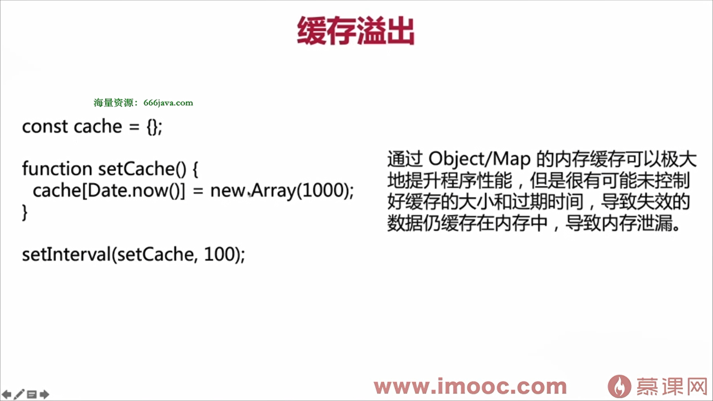
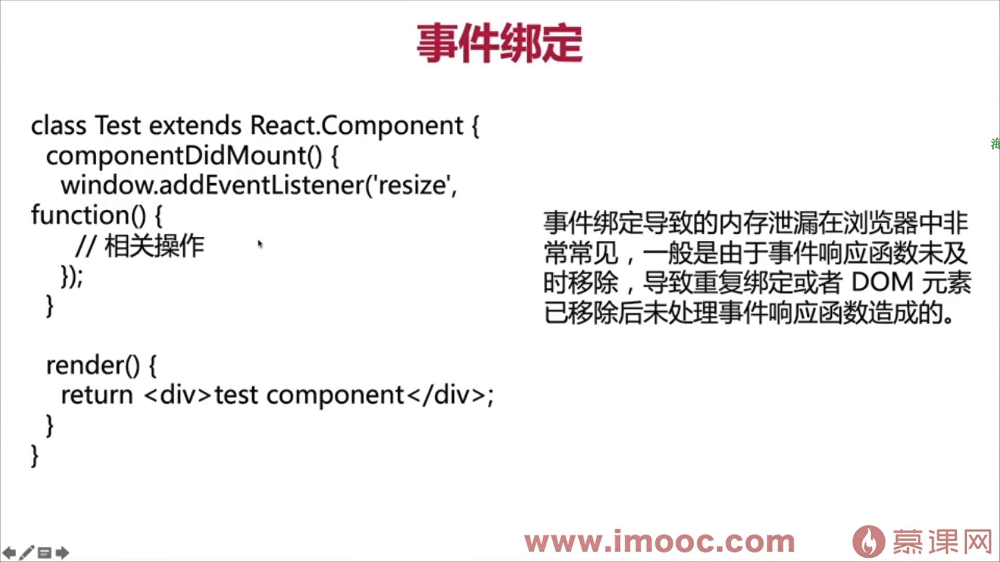
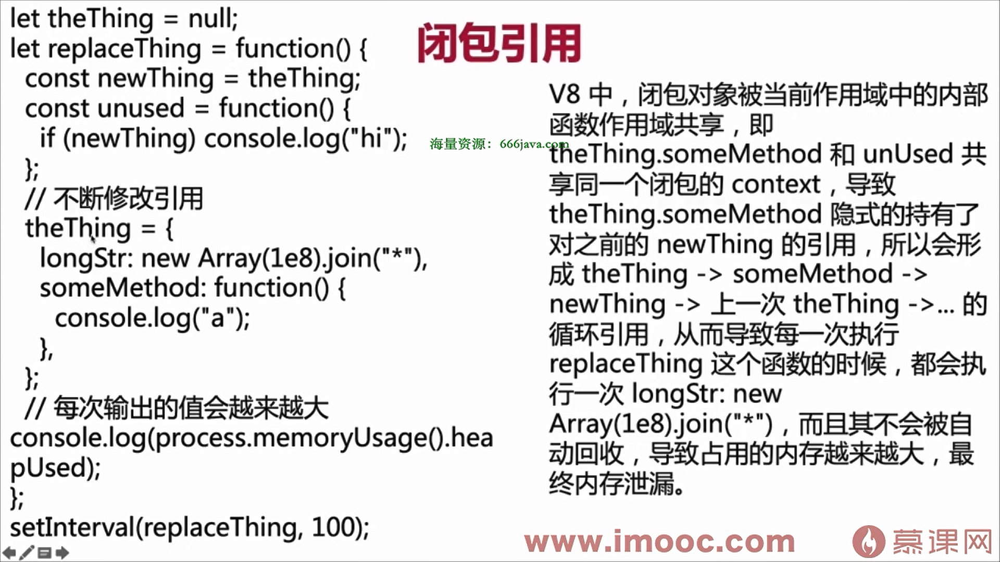
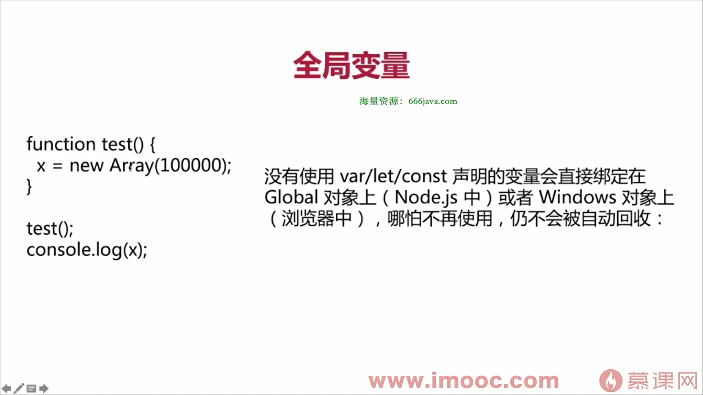

前端内存泄露是指在前端应用中，由于某些原因导致不再使用的内存没有被正确释放，从而导致内存占用持续增加，最终可能引发页面卡顿、崩溃等问题。常见的内存泄露原因和解决方法如下：

### 1. **未清理的定时器**



   - **原因**: 使用 `setInterval` 或 `setTimeout` 后，未及时清除定时器，导致回调函数持续执行。
   - **解决方法**: 在组件卸载或不再需要定时器时，使用 `clearInterval` 或 `clearTimeout` 清除定时器。

   ```javascript
   let timer = setInterval(() => {
       console.log('Timer running');
   }, 1000);

   // 清除定时器
   clearInterval(timer);
   ```

### 2. **未解绑的事件监听器**



   - **原因**: 在 DOM 元素上绑定了事件监听器，但在元素销毁时未解绑，导致事件监听器仍然存在。
   - **解决方法**: 在组件卸载或元素移除时，使用 `removeEventListener` 解绑事件。

   ```javascript
   const handleClick = () => {
       console.log('Clicked');
   };

   document.addEventListener('click', handleClick);

   // 解绑事件
   document.removeEventListener('click', handleClick);
   ```

### 3. **闭包导致的内存泄露**



   - **原因**: 闭包会保留对外部变量的引用，导致这些变量无法被垃圾回收。
   - **解决方法**: 尽量避免在闭包中保留不必要的引用，或者在不再需要时手动解除引用。

   ```javascript
   function createClosure() {
       let largeArray = new Array(1000000).fill('data');
       return function() {
           console.log(largeArray[0]);
       };
   }

   let closure = createClosure();
   // 不再需要时解除引用
   closure = null;
   ```

### 4. **未清理的 DOM 引用**

   - **原因**: 在 JavaScript 中保留了 DOM 元素的引用，即使这些元素已经从页面中移除，仍然无法被垃圾回收。
   - **解决方法**: 在移除 DOM 元素时，确保解除对它的引用。

   ```javascript
   let element = document.getElementById('myElement');
   document.body.removeChild(element);

   // 解除引用
   element = null;
   ```

### 5. **全局变量**



   - **原因**: 全局变量会一直存在于内存中，直到页面关闭，容易导致内存泄露。
   - **解决方法**: 尽量避免使用全局变量，或者在使用完毕后手动将其置为 `null`。

   ```javascript
   let globalData = new Array(1000000).fill('data');

   // 不再需要时解除引用
   globalData = null;
   ```

### 6. **未清理的第三方库**
   - **原因**: 某些第三方库可能会在内部创建一些资源（如事件监听器、定时器等），如果未正确销毁，可能导致内存泄露。
   - **解决方法**: 在使用第三方库时，确保按照文档要求进行初始化和销毁。

### 7. **未清理的 Map 或 Set**
   - **原因**: `Map` 和 `Set` 中存储的对象会一直保留在内存中，除非手动删除。
   - **解决方法**: 在不再需要时，使用 `delete` 或 `clear` 方法清理 `Map` 或 `Set`。

   ```javascript
   let map = new Map();
   map.set('key', 'value');

   // 清理 Map
   map.delete('key');
   map.clear();
   ```

### 8. **未清理的 WebSocket 或 AJAX 请求**
   - **原因**: 未关闭的 WebSocket 连接或未取消的 AJAX 请求可能会导致内存泄露。
   - **解决方法**: 在组件卸载或不再需要时，关闭 WebSocket 连接或取消 AJAX 请求。

   ```javascript
   let socket = new WebSocket('ws://example.com');

   // 关闭 WebSocket
   socket.close();

   let xhr = new XMLHttpRequest();
   xhr.abort(); // 取消 AJAX 请求
   ```

### 9. **未清理的 Vue/React 组件**
   - **原因**: 在 Vue 或 React 中，组件卸载时未清理相关的资源（如事件监听器、定时器等），可能导致内存泄露。
   - **解决方法**: 在组件的生命周期钩子中（如 `beforeUnmount` 或 `componentWillUnmount`）清理资源。

   **Vue 示例**:
   ```javascript
   export default {
       mounted() {
           window.addEventListener('resize', this.handleResize);
       },
       beforeUnmount() {
           window.removeEventListener('resize', this.handleResize);
       },
       methods: {
           handleResize() {
               console.log('Window resized');
           }
       }
   };
   ```

   **React 示例**:
   ```javascript
   class MyComponent extends React.Component {
       componentDidMount() {
           window.addEventListener('resize', this.handleResize);
       }

       componentWillUnmount() {
           window.removeEventListener('resize', this.handleResize);
       }

       handleResize = () => {
           console.log('Window resized');
       };

       render() {
           return <div>My Component</div>;
       }
   }
   ```

### 10. **使用 Chrome DevTools 检测内存泄露**
   - **步骤**:
     1. 打开 Chrome DevTools。
     2. 切换到 **Memory** 选项卡。
     3. 使用 **Heap Snapshot** 或 **Allocation instrumentation on timeline** 工具来检测内存泄露。
     4. 分析内存占用情况，找出未释放的对象。

### 总结
前端内存泄露通常是由于未正确释放资源（如定时器、事件监听器、DOM 引用等）导致的。通过合理管理资源、及时清理不再使用的对象，可以有效避免内存泄露问题。使用 Chrome DevTools 等工具可以帮助你检测和定位内存泄露。