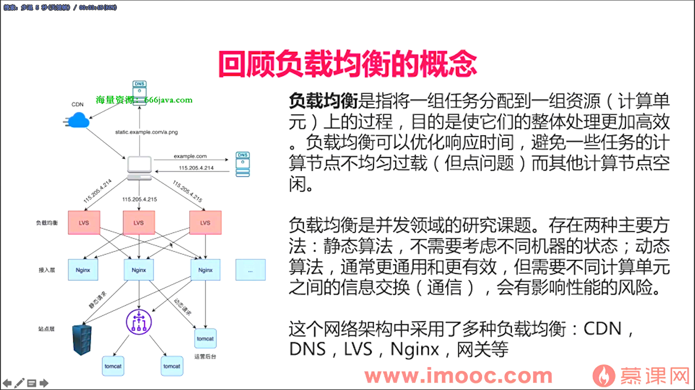
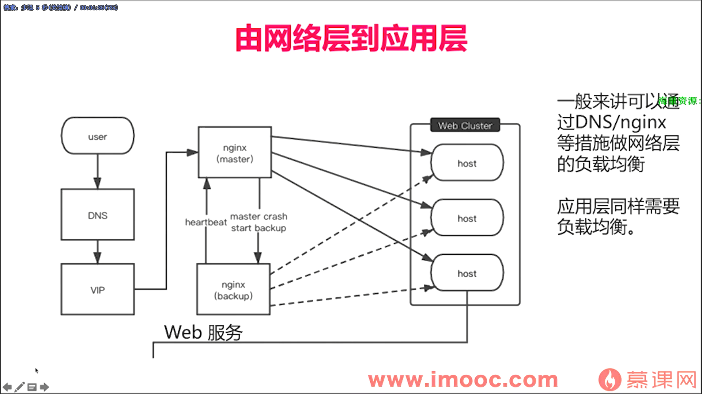
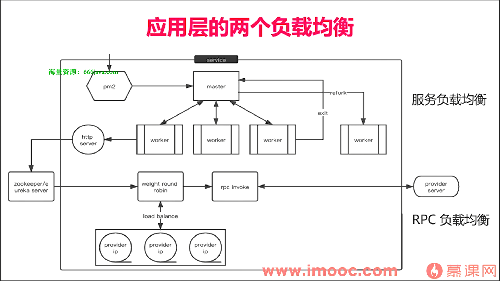
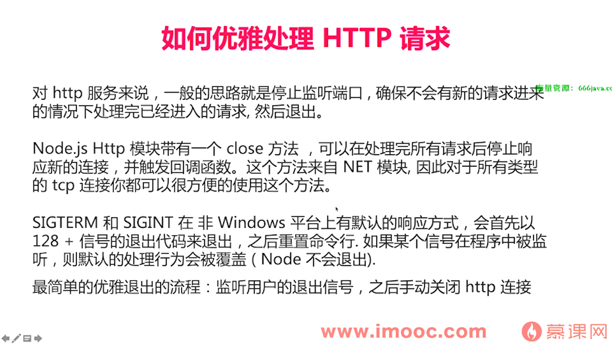
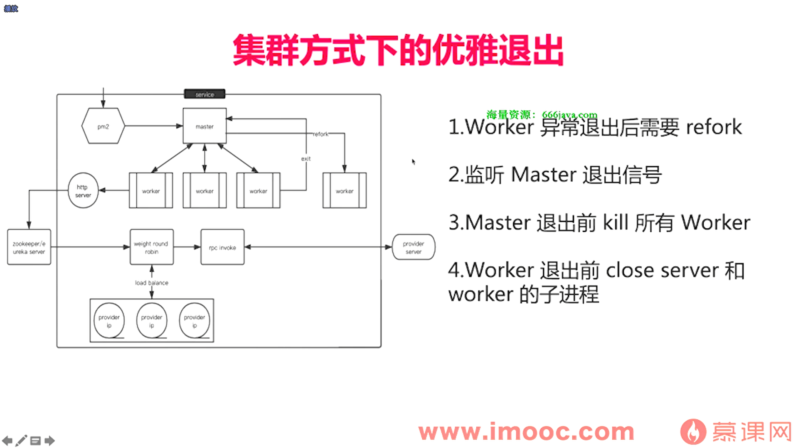
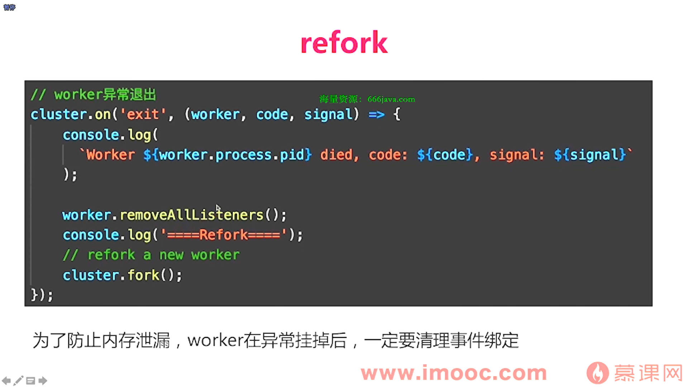
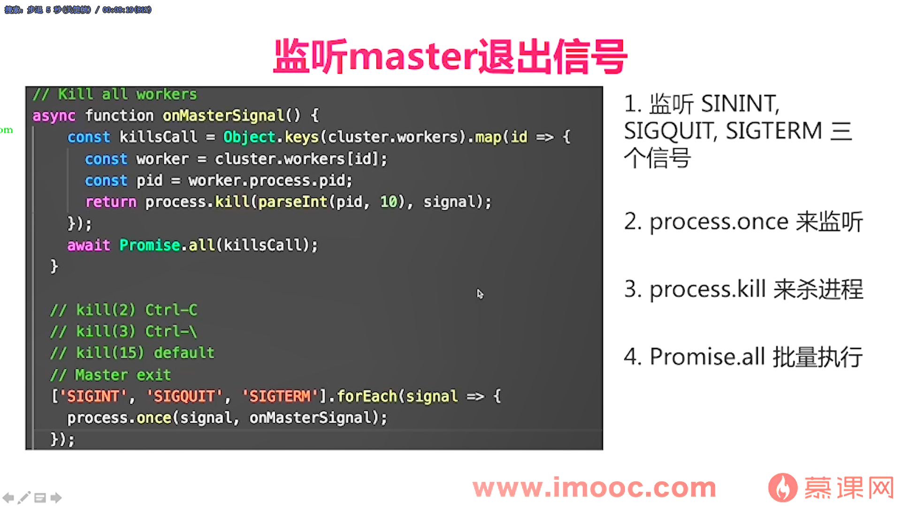
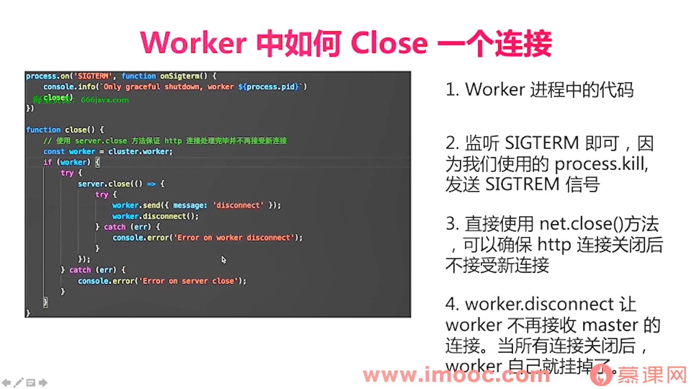
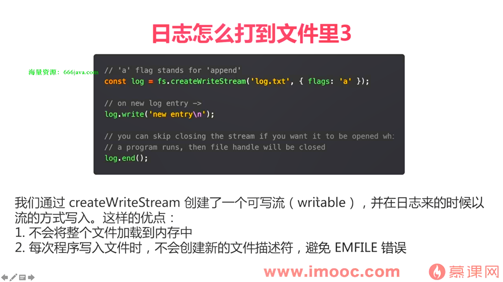

## APM

监控服务的技术手段，监控和管理应用的性能和可用性

### Graphit/Grafana搭建nodejs监控系统


## 高可用,负载均衡







## 优雅退出



单进程退出

```
const http = require('http')
const process = require('process')


const server = http.createServer(function(req,res){
    setTimeout(()=>{
        res.writeHead(200,{'Contetn-Type':'text/plain'})
        res.end('hello world \\n')
    },2000)
}).listen(9000,()=>{
    console.log('start server 9000')
})


//监听信号
process.on('SIGTERM',()=>{
    // 关闭http连接
    server.close(() =>{
        // 退出进程
        process.exit(0)
    })
})
```

集群退出









## 灰度发布

nginx:

降低两台后台权重

````
upstream nginx_canary {
	server nodejs:8000 weight=100
	server nodejs2:8001 weight=down
}

server {

}
````

## PM2

PM2 是一个守护进程管理工具，帮助您管理和守护您的应用程序。

节省应用部署成本

## 日志



### ELK

https://gitee.com/node-apm/elk-demo

下载后运行dockercompose

```
import express from "express";
import log4js from "log4js";
import * as homeController from "./controllers/home";

const app = express();

const PORT: number = app.get("port") || 3000;
const ENV: string = app.get("env");

// log4js.configure({
//   appenders: {
//     console: { type: "console" },
//     // file: { type: "file", filename: "all-the-logs.log" },
//     // https://github.com/Aigent/log4js-logstash-tcp
//     elk_learn: {
//       type: "log4js-logstash-tcp",
//       host: "127.0.0.1",
//       port: 5000
//     }
//   },
//   categories: {
//     default: { appenders: ["elk_learn"], level: "debug" }
//   }
// });

const logger = log4js.getLogger("default");
logger.level = "debug";

app.get("/index", homeController.index);

const server = app.listen(PORT, () => {
  logger.info("App is running at http://localhost:%d in %s mode", PORT, ENV);
  logger.info("Press CTRL-C to stop\n");
});

export default server;
```


### sentry


## 稳定性

## 单元测试

```
npm i mocha chai -s
```

```
const expect = require('chai').expect
const converter = require('../myapp/converter')
const app = require('./myapp/server')
describe('颜色转换器',function(){

	describe('rgb2hex',function(){
		it('基本测试'，function(){
			const redHex = converter.reg2Hex(255,0,0)
			expect(redHex).to.equal('ffff00')
		})
	});
	
	
	#定义钩子，自动打开服务
	let server
	before(function(){
		server = app.listen(3000)
	})
	after(function(){
		server.close()
	})
	describe('hex2rgb',function(){
		it('基本测试'，function(){
			const hexRbg = converter.hex2Rgb('ffff00')
			expect(hexRbg).to.deep.equal([255,0,0])
		})
		
		const url = 'http://localhost:3000/rgbhex?a=1'
		## 测试异步 
		it('服务可用'，function(done){
		
			request(url,function(err,response,body){
				expect(response.statusCode).to.equal(200)
			})
		})
	})
})
```

npm run test

## 内存泄漏 

