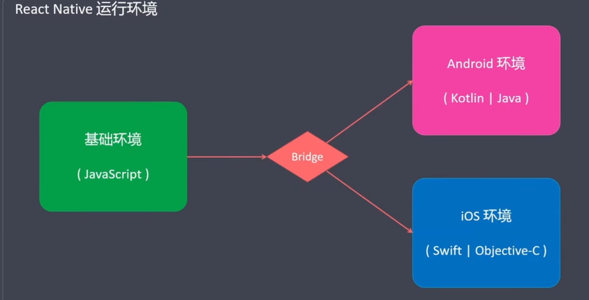
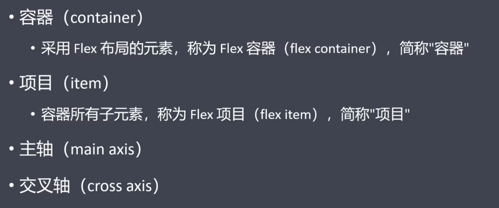
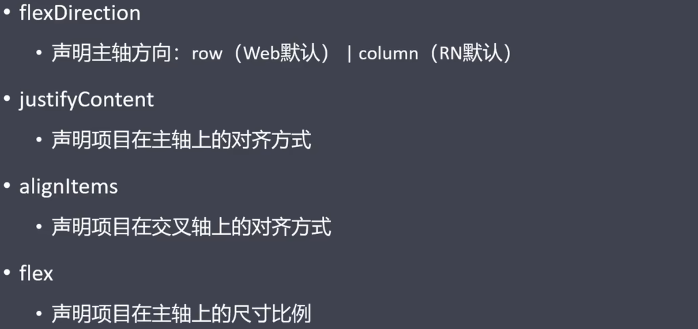
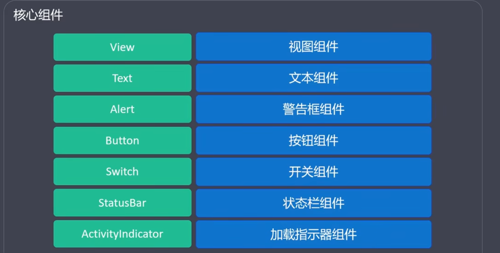
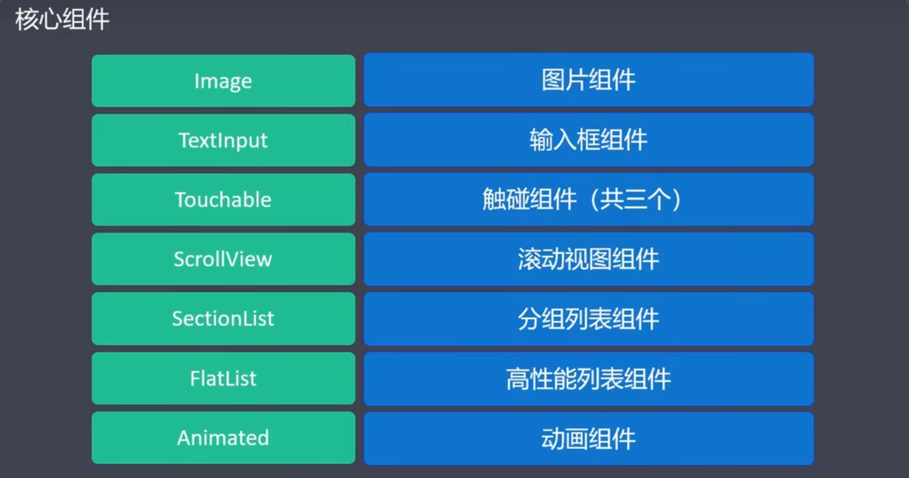
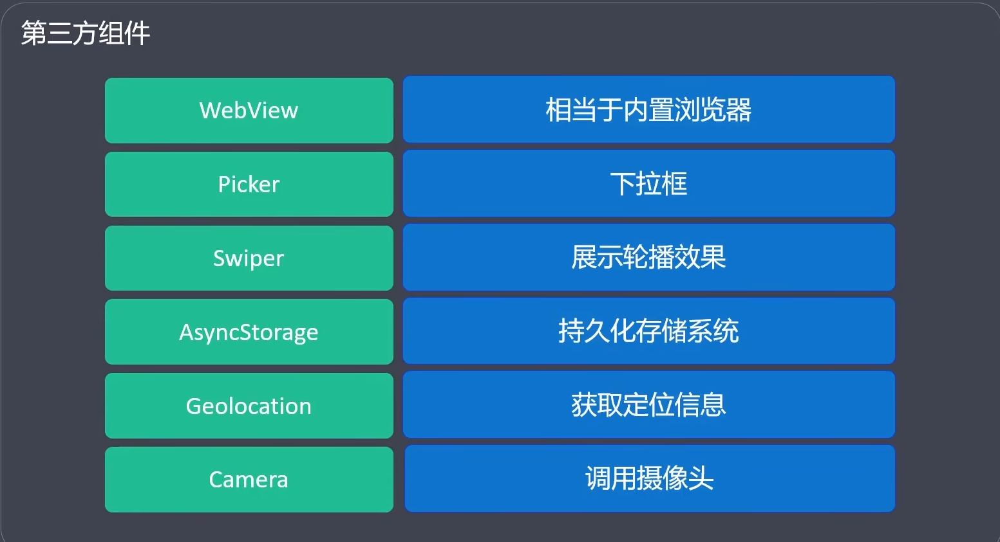
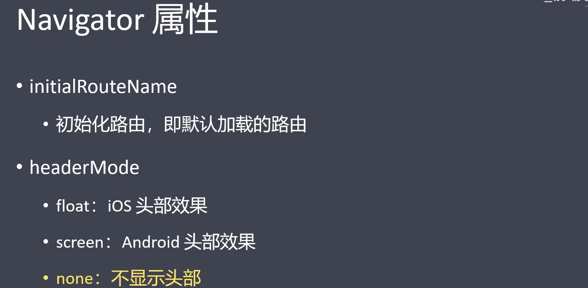
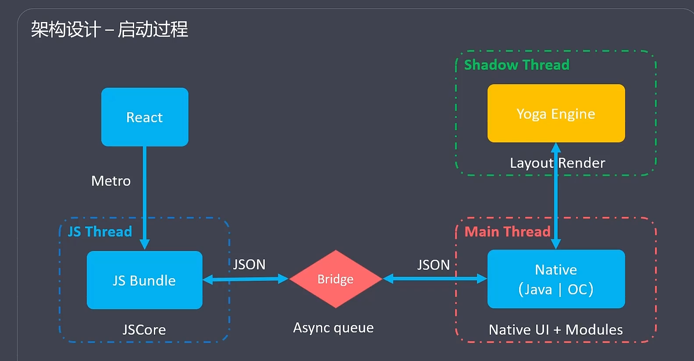
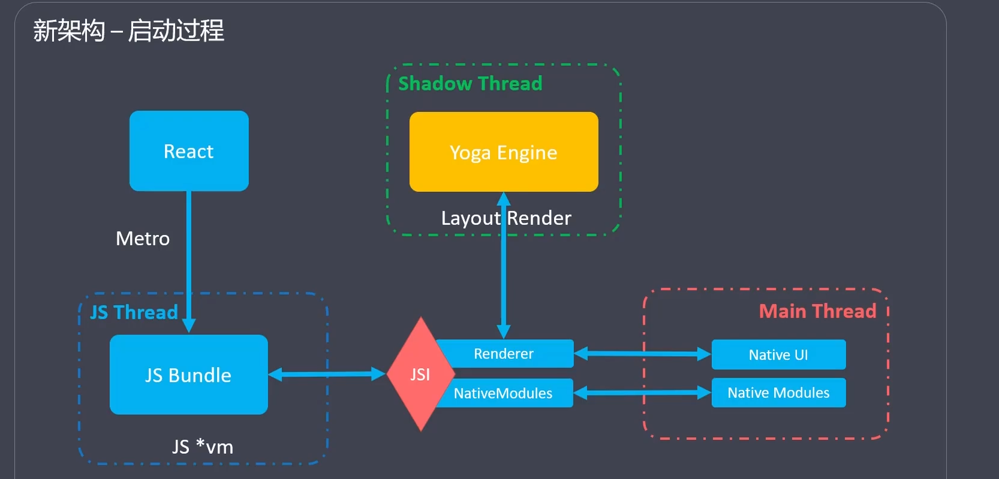

原生应用：java开发，直接运行在安卓，ios上的应用

混合开发：js开发，直接运行在安卓，ios上的应用

web开发：运行在浏览器，webview

## windows环境搭建Android



安装jdk

安装Android studio（目的是获取sdk和虚拟设备）

安装Android sdk

## Gradle 报错

因为墙的原因：Could not install Gradle distribution from 'https://services.gradle.org/distributions/gradle-8.7-bin.zip'.
Reason: java.net.SocketTimeoutException: Read timed out


打开gradle-wrapper.properties

原路径:

```
distributionUrl=https\://services.gradle.org/distributions/gradle-2.10-all.zip
```

修改为

```
distributionUrl=https\://mirrors.cloud.tencent.com/gradle/gradle-2.10-all.zip
```

 

## read time out报错

改为国内镜像

```
buildscript {
    ext {
        buildToolsVersion = "34.0.0"
        minSdkVersion = 23
        compileSdkVersion = 34
        targetSdkVersion = 34
        ndkVersion = "26.1.10909125"
        kotlinVersion = "1.9.24"
    }
    repositories {
        maven{ url 'https://maven.aliyun.com/repository/google'}//重点关注这一行
        google()
        mavenCentral()
    }
    dependencies {
        classpath("com.android.tools.build:gradle:7.3.1")
        classpath("com.facebook.react:react-native-gradle-plugin")
    }

}

allprojects {
    repositories {
        maven{ url 'https://maven.aliyun.com/repository/google'} //重点关注这一行
        google()
        jcenter()
    }
}

```


## Android Gradle plugin requires Java 11 

部分插件需要Java11，

需要注意gradle的Java版本并非AndroidStudio工程依赖的Java版本。

gradle版本可以随意设置

```
生成jra文件  bin\jlink.exe --module-path jmods --add-modules java.desktop --output jre
Java 11 与 Java 8 共存

环境变量设置两种，
JAVA_HOME  = %JAVA8_HOME%   //按需切换
同时将默认的环境变量 orcal/javapath  放在path中的 JAVA_HOME下方
```

## gradle 与 gradle 插件版本不对应

官网找

## 调试 

CTRL+m  显示debug模式，按照浏览器方式调试 

1. 在 Chrome 浏览器窗口中，导航到 `chrome://inspect`。
2. 使用 "Configure..." 按钮添加开发服务器地址（通常是 `localhost:8081`）。
3. 现在应该能看到一个带有 **"inspect"** 链接的 "Hermes React Native" 目标。点击这个链接打开调试器。

# react native

## 样式表

RN中的样式没有继承性，即成只发生在text组件上

尺寸没有单位

特殊样式marginhorizon...

```

import {StyleSheet}  from 'react-native'

const style = StyleSheet.create({foo:{color:'red'}})

<View  style={[style.foo]}></View>
```

## Flexbox布局

比如垂直居中效果



主轴默认垂直方向



## 响应式布局

不同页面大小，显示不同的内容

flexbox  +  Dimensions

```
import {Dimensions}  from 'react-native'

width :Dimensions.get('window').width
```

## 组件

### 核心组件

：对ios,android原生组件进行封装





Platform.OS ==='ios'   //android   两种操作系统

### 动画

也可以借助react-native-animatable库

可以直接使用的动画组件

Animated.View

Animated.Text

Animated.ScrollView

Animated.Image

其他组件需要自己利用Animated.createAnimatedComponent(ScrollView);进行封装，变为动画组件

`本质就是不断的修改值，再将值赋予动画组件的某个样式属性上`

```
import React, {useRef} from 'react';
import {
  Animated,
  Text,
  View,
  StyleSheet,
  Button,
  SafeAreaView,
} from 'react-native';

const App = () => {
  // fadeAnim will be used as the value for opacity. Initial Value: 0
  const fadeAnim = useRef(new Animated.Value(0)).current;

  const fadeIn = () => {
    // Will change fadeAnim value to 1 in 5 seconds
    Animated.timing(fadeAnim, {
      toValue: 1,
      duration: 5000,
      useNativeDriver: true,
    }).start();
  };


  return (
    <SafeAreaView style={styles.container}>
      <Animated.View
        style={[
          styles.fadingContainer,
          {
            // Bind opacity to animated value
            opacity: fadeAnim,
          },
        ]}>
        <Text style={styles.fadingText}>Fading View!</Text>
      </Animated.View>
      <View style={styles.buttonRow}>
        <Button title="Fade In View" onPress={fadeIn} />
      
      </View>
    </SafeAreaView>
  );
};

const styles = StyleSheet.create({
  container: {
    flex: 1,
    alignItems: 'center',
    justifyContent: 'center',
  },
  fadingContainer: {
    padding: 20,
    backgroundColor: 'powderblue',
  },
  fadingText: {
    fontSize: 28,
  },
  buttonRow: {
    flexBasis: 100,
    justifyContent: 'space-evenly',
    marginVertical: 16,
  },
});

export default App;
```

### 第三方组件

react-native-paper组件库

github 或是 npm 上搜索到带有`react native`关键字的大量的第三方组件。

需要手动安装,git中查看使用



```
yarn add react-native-webview
```

webview：渲染url和html

react-native-image-picker  选取照片

react-native-storage   持久化存储

### 自定义组件

同react

## React Native本地持久化存储方案

### 1、AsyncStorage

#### 1.1 介绍

- 异步API：AsyncStorage是异步的，它的所有方法都返回一个Promise对象。
- 轻量级：AsyncStorage存储的数据是基于键值对的，仅支持存储字符串类型的数据，因此不适合存储大型数据。
- 永久存储：AsyncStorage存储的数据是永久性的，即使应用程序被关闭或设备重启，数据仍然会保留。

#### 1.2 适用场景

适用于存储小型的键值对数据、应用程序逻辑和其他人的公共数据，例如应用程序的配置信息、用户授权信息等。

#### 1.3 示例

```javascript
javascript 代码解读复制代码
import React, { useState } from 'react';
import { View, Text, TextInput, Button } from 'react-native';
import AsyncStorage from '@react-native-async-storage/async-storage';

const App = () => {
  const [text, setText] = useState('');
  const [savedText, setSavedText] = useState('');

  const saveData = async () => {
    try {
      await AsyncStorage.setItem('myKey', text);
      setSavedText(text);
      setText('');
    } catch (e) {
      console.error(e);
    }
  };

  const getData = async () => {
    try {
      const value = await AsyncStorage.getItem('myKey');
      if (value !== null) {
        setSavedText(value);
      }
    } catch (e) {
      console.error(e);
    }
  };

  return (
    <View style={{ flex: 1, alignItems: 'center', justifyContent: 'center' }}>
      <Text>Enter some text:</Text>
      <TextInput
        style={{ height: 40, width: '80%', borderColor: 'gray', borderWidth: 1, margin: 10 }}
        onChangeText={text => setText(text)}
        value={text}
      />
      <Button title="Save" onPress={saveData} />
      <Button title="Load" onPress={getData} />
      <Text>Saved text: {savedText}</Text>
    </View>
  );
};

export default App;
```

### 2、SQLite（react-native-sqlite-storage）

#### 2.1 介绍

- 轻量级：sqlite是一种轻量级的数据库引擎。
- 跨平台支持：支持iOS和Android平台。
- SQL支持：支持标准SQL查询，包括SELECT、INSERT、UPDATE和DELETE语句。
- 支持事务：react-native-sqlite-storage支持事务，这对于需要确保数据的一致性和完整性的应用程序非常重要。
- 离线存储：react-native-sqlite-storage允许您在设备离线时访问存储在本地数据库中的数据。
- 高性能：由于sqlite是一种本地数据库引擎，因此react-native-sqlite-storage可以提供快速的读取和写入速度。
- 良好的文档支持：react-native-sqlite-storage有详细的文档和示例，易于入门和使用。

#### 2.2 适用场景

适用于需要在本地存储大量结构化数据并进行复杂查询的场景，例如电商应用中的订单数据、商品数据等。

#### 2.3 优缺点

| 优点                                                         | 缺点                                                         |
| ------------------------------------------------------------ | ------------------------------------------------------------ |
| 作为—个无服务器的数据库，SQLite无需使用服务器即可运行，因此它非常易用。 | 正是由于无服务器的特性，SQLite数据库只能在其所属的系统上被访问到。也是就是说，它不允许在另一台PC上被远程执行。 |
| 由于无服务器不涉及到任何设置，因此轻量级的SQLite既不会受到非必要功能的拖累，又减少了因大量的数据库管理，而产生的资源开销。 | SQLite虽然小巧轻便，且非常适合在PC或手机上被用作本地存储，但是它不太适合并发用户多、数据量大的大型应用。这些应用往往需要功能更强大、基于服务器的数据库管理系统(DBMS)。 |
| 由于SQLite按需加载数据，而非整个文件，因此它通常比基于服务器或文件的竞品更快。 | 由于只是一个小型数据库，因此SQLite可以容纳的数据量比较有限。而且，由于SQLite只能在单个磁盘文件中维护完整的数据库，因此其文件的大小也受到了系统能力的限制。 |
| 由于SQLite是自包含的，不需要操作系统或外部库的过多支持，因此这也有助于提高其性能与效率。 |                                                              |

#### 2.4 示例

```javascript
javascript 代码解读复制代码import SQLite from 'react-native-sqlite-storage';

//打开数据库
var db = SQLite.openDatabase({name: 'test.db', createFromLocation: '~test.db'});

//创建表
db.transaction(function(tx) {
  tx.executeSql('CREATE TABLE IF NOT EXISTS TestTable (id INTEGER PRIMARY KEY AUTOINCREMENT, name TEXT)');
});

//插入数据
db.transaction(function(tx) {
  tx.executeSql('INSERT INTO TestTable (name) VALUES (?)', ['John']);
});

//查询数据
db.transaction(function(tx) {
  tx.executeSql('SELECT * FROM TestTable', [], function(tx, results) {
    var len = results.rows.length;
    for (let i = 0; i < len; i++) {
      var row = results.rows.item(i);
      console.log('id: ' + row.id + ', name: ' + row.name);
    }
  });
});

//删除数据
db.transaction(function(tx) {
  tx.executeSql('UPDATE TestTable SET name = ? WHERE id = ?', ['Jane', 1]);
});

//关闭数据库
db.close();
```

### 3、WatermelonDB

#### 3.1 介绍

- 由于使用延迟加载，Watermelon DB可以只在被请求时才加载数据。据此，应用程序的可扩展性可以得到大幅增强。
- 由于所有的查询都是在其不同的线程上完成的，因此大多数查询只需不到1毫秒的时间。
- WatermelonDB使用SQLite作为底层存储引擎，并提供了一个易于使用的API和 React Native的集或。
- 无论后端的数据体量有多大，都可以立即启动应用程序。
- 具有快速、异步、多线程和高度缓存等特性，也可与同步引擎协同工作，以保持原生本地数据库与远程数据库的同步。

#### 3.2  适用场景

适用于需要在本地存储大量数据并进行复杂查询的场景，例如社交应用中的用户数据、消息数据等。同时，WatermelonDB提供了实时同步和离线数据访问功能，适用于对数据实时性和离线使用场景要求较高的应用。

#### 3.3 优缺点

| 优点                                                         | 缺点                                                         |
| ------------------------------------------------------------ | ------------------------------------------------------------ |
| 区别于Realm Web SDK仅提供在线模式，开发人员既可以为WatermelonDB创建Web版本,又可以在本地保存数据。 | 为了同步数据，开发人员不但需要创建其后端，而且需要为身份验证并制作一套REST API。 |

#### 3.3  示例

[github.com/Nozbe/Water…](https://link.juejin.cn?target=https%3A%2F%2Fgithub.com%2FNozbe%2FWatermelonDB%2Ftree%2Fmaster%2Fexamples%2Ftypescript)

### 4、realm

#### 4.1 介绍

- 一个高性能、跨平台的数据库引擎，具有良好的性能、加密支持以及复杂数据结构的支持。
- 由于Realm属于对象存储，因此对象之间的关系可以通过各种“链接”来实现。
- 每个“链接”都能够创建一个与链接到当前对象的“反向链接”映射。
- Realm可以更新其实例版本。
- Realm带有零拷贝（zero-copy）架构，以及延迟加载（lazy-loaded）式的数据访问。

#### 4.2 适用场景

适用于存储大量的结构化数据，例如应用程序中的用户数据、日志等。同时，Realm提供了加密和实时同步功能，适用于对数据安全性和实时性要求较高的场景。

#### 4.3  优缺点

| 优点                                     | 缺点                                                         |
| ---------------------------------------- | ------------------------------------------------------------ |
| 速度优于其他数据库                       | 和其他数据库相比，功能比较基础                               |
| 它能与各种平台兼容                       | 可能无法快速地存储realm的整体结构可能无法快速地存储realm的整体结构 |
| 用户可以免费且便捷地将其合并到某个项目中 |                                                              |
| 自带丰富的文档                           |                                                              |

#### 4.4 示例

```javascript
javascript 代码解读复制代码// 引入realm模块
const Realm = require('realm');

// 定义数据模型
const PersonSchema = {
  name: 'Person',
  properties: {
    name: 'string',
    age: 'int',
    address: 'string?',
  }
};

// 打开数据库
Realm.open({
  schema: [PersonSchema],
})
  .then(realm => {
    // 插入数据
    realm.write(() => {
      realm.create('Person', { name: 'John', age: 30 });
    });

    // 查询数据
    const people = realm.objects('Person');
    console.log(people);

    // 更新数据
    realm.write(() => {
      people[0].age = 31;
    });

    // 删除数据
    realm.write(() => {
      realm.delete(people[0]);
    });

    // 关闭数据库
    realm.close();
  })
  .catch(error => {
    console.log(error);
  });
```

### 5、PouchDB

#### 5.1 介绍

- 基于CouchDB的JavaScript数据库。可以在浏览器和移动设备上使用，支持离线同步和复制功能。
- 应用在离线时，将数据保存在本地，而在应用重新上线后，再与CouchDB和其他兼容的服务器相同步，以确保用户的数据始终为最新。
- 提供的API在所有浏览器中都是相同的，因此它可以在各种浏览器中被流畅地使用。

#### 5.2 适用场景

适用于需要在本地存储大量数据并进行复杂查询的场景，同时需要支持离线同步和复制功能的应用，例如协同办公应用、离线地图等。

#### 5.3 优缺点

| 优点                                                         | 缺点                                                         |
| ------------------------------------------------------------ | ------------------------------------------------------------ |
| 由于PouchDB被嵌入在浏览器中，因此我们无需通过网络，便可实现极快速的查询。 | 如果数据库体量较大，或者有许多待发送的密钥，那么其运行速度会被拖慢。 |
| 由于可以将数据与任何被支持的服务器进行同步，因此其应用实现了在线与离线的等效。 |                                                              |

#### 5.4 示例

[github.com/seigel/pouc…](https://link.juejin.cn?target=https%3A%2F%2Fgithub.com%2Fseigel%2Fpouchdb-react-native%2Fblob%2Fmaster%2Fexample%2Fapp.js)

### 6、react-native-firebase

#### 6.1 介绍

- 一个云端的NoSQL数据库
- 支持实时同步和离线数据访问
- 可以让开发人员更专注于打造出色的用户体验，而无需管理服务器
- 按照云托管数据库的需求，Firebase可以将数据以JSON格式进行存储，并进一步持续同步到每个关联的客户端上
- 作为基于云服务的数据库，它可被用于管理应用程序的数据，并提供快速的数据结果

#### 6.2 适用场景

适用于需要在云端存储和同步实时数据的应用，例如实时聊天应用、实时数据监控等。

#### 6.3 优缺点

| 优点                                                         | 缺点                                                         |
| ------------------------------------------------------------ | ------------------------------------------------------------ |
| 可以调用电子邮件、密码、Google.Facebook和 Github进行身份验证。 | 由于传统的关系数据模型不适合NoSQL，因此Firebase的数据流在查询上会受到—定的限制。 |
| 可提供实时的数据。                                           | 在安装过程中，无法提供现场服务支持。                         |
| 可提供现成的API。                                            |                                                              |
| 可在数据节点上内置安全性，并由Google Cloud Storage提供文件存储。 |                                                              |
| 可托管各种静态文件。                                         |                                                              |
| 在创建高度可扩展的应用时，可将数据视为数据流。               |                                                              |
| 不必担心基础架构的状态。                                     |                                                              |

#### 6.4 示例

[rnfirebase.io/typescript](https://link.juejin.cn?target=https%3A%2F%2Frnfirebase.io%2Ftypescript)

### 7、MMKV

#### 7.1 介绍

- 腾讯开发用在微信上的一个高效、小型的移动键值存储框架。
- 支持redux-persist（持久化），并且允许用户保存任何形式（无论是否加密）的数据。
- 高性能的本地存储：MMKV是一种基于mmap技术的本地存储框架，具有很高的读写性能，尤其适用于存储大量的数据或需要频繁读写的数据。
- 数据加密和安全性：MMKV支持AES-256加密算法，可以保护存储在本地的敏感数据的安全性。
- 快速的数据访问：MMKV可以通过内存映射技术实现快速的数据访问，可以避免反复的IO操作，提高应用程序的响应速度。
- 跨平台移动应用开发：支持iOS、Android和Web。

#### 7.2 优缺点

| 优点                                           | 缺点                                                         |
| ---------------------------------------------- | ------------------------------------------------------------ |
| 针对安全的本地存储，MMKV提供了相应的加密功能。 | 同步存储往往需要更为简单的应用代码。                         |
| 具有同步存储的特性。                           | 对于初学者的学习曲线较为陡峭（当然，对于同步存储而言，则比较容易上手)。 |
| 代码效率更高。                                 | 由于它是基于JSI构建的，因此无法在Chrome调试器中运行，而只能选用Flipper。 |

#### 7.3 示例

[github.com/mrousavy/re…](https://link.juejin.cn?target=https%3A%2F%2Fgithub.com%2Fmrousavy%2Freact-native-mmkv%2Ftree%2Fmaster%2Fexample)

### 8、Vasern

#### 8.1 介绍

- 基于链接一致性的键-值存储式React Native数据存储系统。
- 其数据引擎是从头开始创建的，因此Vasern提供了原生的性能。
- 它通过UTF-8编码来支持各种语言。
- 能够支持字符串、整数、双精度、日期时间、以及引用等基本数据类型。
- 可以通过schema来创建、更新、查询和删除各种记录。

#### 8.2 优缺点

| 优点                                                         | 缺点                                       |
| ------------------------------------------------------------ | ------------------------------------------ |
| Vasern不仅可被用于本地数据存储，还能被用于云端存储与应用客户端之间的同步。 | 相对其他Vasern社区不够强大，维护状态较差。 |
| 属于—种快速、轻量级、且开源的ReactNative数据存储解决方案。   |                                            |
| 它通过提供简单的API，允许支持原生的移动应用开发，并让程序员更专注于应用本身，而非数据库的设置与优化。 |                                            |
| 可以在开发的过程中，轻松地安装、运行和同步数据到Vasern服务器上。 |                                            |

#### 8.3 示例

[vasern.github.io/docs/todo-e…](https://link.juejin.cn?target=https%3A%2F%2Fvasern.github.io%2Fdocs%2Ftodo-example)

### 9、结论

SQLite、Realm相对其他方案更成熟、提供更多工具和库，两种存储方案相较之下，选择Realm更快、更简单、更易用，可以减少开发成本。

**推荐使用Realm的理由：**

1. 易用性：Realm提供了一系列方便的API，可以轻松地实现数据的插入、更新、删除等操作。并且提供了简单易用的数据模型定义语言，可以轻松地定义数据模型和关系。
2. 安全性：Realm支持数据加密，可以保证数据的安全性。
3. 跨平台支持：Realm可以在多个平台上运行，包括iOS、Android、React Native、Node.js、React等。
4. 快速访问：Realm使用了高效的内存映射技术，可以将数据直接加载到内存中，从而获得更快的数据访问速度。
5. 社区支持：Realm具有良好的社区支持和文档，可以帮助开发人员更好地使用和理解它的使用方式。

作者：chang
链接：https://juejin.cn/post/7359578747861270555
来源：稀土掘金
著作权归作者所有。商业转载请联系作者获得授权，非商业转载请注明出处。

## 路由与导航

借助react-navigation

```
npm install @react-navigation/native
npm install react-native-screens react-native-safe-area-context
```

`android/app/src/main/java/MainActivity.kt`中添加.

````
import android.os.Bundle;

class MainActivity: ReactActivity() {
  // ...
  override fun onCreate(savedInstanceState: Bundle?) {
    super.onCreate(null)
  }
  // ...
}
````
`index.js or App.js`中引入，NavigationContainer包裹整个应用

```
import * as React from 'react';
import { NavigationContainer } from '@react-navigation/native';

export default function App() {
  return (
    <NavigationContainer>{/* Rest of your app code */}</NavigationContainer>
  );
}
```

### 报错no viewmanager found for class RNSScreenStackHanderConfig

关了重启，自动清除缓存

### stack导航

头部导航

RN中没有history功能，需要先声明在Stack中

```
import * as React from 'react';
import { View, Text,Button } from 'react-native';
import { NavigationContainer } from '@react-navigation/native';
import { createNativeStackNavigator } from '@react-navigation/native-stack';

function HomeScreen({ navigation }) {
  return (
    <View style={{ flex: 1, alignItems: 'center', justifyContent: 'center' }}>
      <Text>Home Screen</Text>
      <Button
        title="Go to Details"
        onPress={() => navigation.navigate('Details')}  //跳转到指定页面
      />
    </View>
  );
}

function DetailsScreen({ navigation }) {
  return (
    <View style={{ flex: 1, alignItems: 'center', justifyContent: 'center' }}>
      <Text>Details Screen</Text>
      <Button
        title="Go to Details... again"
        onPress={() => navigation.push('Details')}
      />
    </View>
  );
}


const Stack = createNativeStackNavigator();

function App() {
  return (
    <NavigationContainer>
      <Stack.Navigator>
        <Stack.Screen name="Home" component={HomeScreen} />   //屏幕显示
        <Stack.Screen name="Details" component={DetailsScreen} />
      </Stack.Navigator>
    </NavigationContainer>
  );
}

export default App;

```

navigator属性(所有路由)

```
 <Stack.Navigator initialRouteName="Home">
```



screens属性（单个路由）

```
<Stack.Screen
        name="Home"
        component={HomeScreen}
        options={{
          title: 'My home',
          headerStyle: {
            backgroundColor: '#f4511e',
          },
          headerTintColor: '#fff',
          headerTitleStyle: {
            fontWeight: 'bold',
          },
        }}
      />
```

### BottomTabs

底部按钮导航

```
import * as React from 'react';
import { View, Text, Button } from 'react-native';
import { NavigationContainer } from '@react-navigation/native';
import { createNativeStackNavigator } from '@react-navigation/native-stack';
import { createBottomTabNavigator } from '@react-navigation/bottom-tabs';


function HomeScreen({ navigation }) {
  return (

    <Tab.Navigator
      screenOptions={({ route }) => ({
        tabBarIcon: ({ focused, color, size }) => {
          return <Text>heelo</Text>;
        },
        tabBarActiveTintColor: 'tomato',
        tabBarInactiveTintColor: 'gray',
      })}
    >
      <Tab.Screen name="Index" component={Index} options={{ tabBarBadge: 3 }} />
      <Tab.Screen name="Settings" component={SettingsScreen} />
    </Tab.Navigator>

  );
}

function Index({ navigation }) {
  return (
    <View style={{ flex: 1, alignItems: 'center', justifyContent: 'center' }}>
      <Text>index Screen</Text>

      <Button
        title="Go to Details"
        onPress={() => navigation.navigate('Details')}
      />
    </View>
  )
}

function SettingsScreen() {
  return (
    <View style={{ flex: 1, justifyContent: 'center', alignItems: 'center' }}>
      <Text>Settings!</Text>
    </View>
  );
}


function DetailsScreen({ navigation }) {
  return (
    <View style={{ flex: 1, alignItems: 'center', justifyContent: 'center' }}>
      <Text>Details Screen</Text>
      <Button
        title="Go to Details... again"
        onPress={() => navigation.push('Details')}
      />
    </View>
  );
}


const Stack = createNativeStackNavigator();
const Tab = createBottomTabNavigator();


function App() {
  return (
    <NavigationContainer>
      <Stack.Navigator>
        <Stack.Screen name="Home" component={HomeScreen} />
        <Stack.Screen name="Details" component={DetailsScreen} />
      </Stack.Navigator>
    </NavigationContainer>
  );
}

export default App;

```

### Drawer 导航

抽屉效果菜单

```
npm install @react-navigation/drawer

npm install react-native-gesture-handler react-native-reanimated

```
新建两个文件
```
gesture-handler.native.js
// Only import react-native-gesture-handler on native platforms
import 'react-native-gesture-handler';

gesture-handler.js
// Don't import react-native-gesture-handler on web
```
在app.js或 index.js中引入
import './gesture-handler';

babel.config.js中添加插件

plugins: ['react-native-reanimated/plugin'],添加到末尾，重启项目

### Material Top Tabs 

顶部导航，支持滑动切换，区别于stack导航只能点击切换

## 路由传参

```
navigation.navigate('Home',{key:3})  //传递参数

function DetailsScreen({ navigation，route }) {
  return (
    <View style={{ flex: 1, alignItems: 'center', justifyContent: 'center' }}>
      <Text>Details Screen</Text>
      <Button
        title="Go to Details... again"
        onPress={() => {navigation.push('Details'),log(route.params.key)}  //接受参数
      />
    </View>
  );
} 
```


## 图标

react-native-vector-icons  矢量图标库（AntDesign等）

## 架构





## Redux

```
yarn add redux
yarn add react-redux
yarn add react-thunk   //支持异步操作
```

# Flutter

下载Flutter SDK包，将bin目录添加到环境变量

下载Flutter插件，构建项目，F5启动项目

[Flutter中文网](https://book.flutterchina.club/chapter2/flutter_widget_intro.html#_2-2-1-widget-%E6%A6%82%E5%BF%B5)

## 布局组件

### 固定宽高比

AspectRatio(aspectRatio: 16/9,child: Text("sfsf"),)

### 堆叠布局

Stack(children: [Text("2344555"),Positioned(child: Icon(Icons.ac_unit),right: 10.0,)],)

### 小标签

Chip(label: Text("html"),avatar: CircleAvatar(backgroundColor: Colors.red,),)

## fluro
第三方路由管理

```
flutter pub add fluro
```

pubspec.yaml添加

```
dependencies:
  flutter:
    sdk: flutter

  fluro: "^2.2.36"   //new
```

https://github.com/lukepighetti/fluro?tab=readme-ov-file

routes.dart

```
class Routes {
  static String root = "/";
  static String demoSimple = "/demo";
  

  static void configureRoutes(FluroRouter router) {
    router.notFoundHandler = Handler(
        handlerFunc: (BuildContext? context, Map<String, List<String>> params) {
      print("ROUTE WAS NOT FOUND !!!");
      return;
    });  //404处理
    router.define(root, handler: Handler(
        handlerFunc: (BuildContext? context, Map<String, List<String>> params) {
      return HomeComponent();
    }));
    router.define(demoSimple, handler:  Handler(
        handlerFunc: (BuildContext? context, Map<String, List<String>> params) {
          String? message = params["message"]?.first;
          String? colorHex = params["color_hex"]?.first;
          String? result = params["result"]?.first;
          Color color = Color(0xFFFFFFFF);
          if (colorHex != null && colorHex.length > 0) {
            color = Color(ColorHelpers.fromHexString(colorHex));
          }
      return DemoSimpleComponent(
        message: message ?? 'Testing', color: color, result: result);
    }));  //带参数路由
  }
}
```

main.dart

```
import 'package:fluro/fluro.dart';
import '../../config/routes.dart';

class AppComponentState extends State<AppComponent> {
  AppComponentState() {
    final router = FluroRouter();   //定义路由
    Routes.configureRoutes(router);  //配置路由
    Application.router = router;   //全局变量存储
  }

  @override
  Widget build(BuildContext context) {
    final app = MaterialApp(
      title: 'Fluro',
      debugShowCheckedModeBanner: false,
      theme: ThemeData(
        primarySwatch: Colors.blue,
      ),
      onGenerateRoute: router.generator,  //绑定路由

    );
//    print("initial route = ${app.initialRoute}");
    return app;
  }
}
```

可以建立单独文件，保存router，做全局变量

```
class Application {
  static late final FluroRouter router;
}
```

使用    

```
				onPressed: () {
                  if (result == null) {
                    /// You can use [Navigator.pop]
                    Navigator.pop(context);
                  } else {
                    /// Or [FluroRouter.pop]
                    FluroRouter.appRouter.pop(context, result);
                  }
                },
                
                Application.router.navigateTo(context, "/demo/func?message=$message");
```

