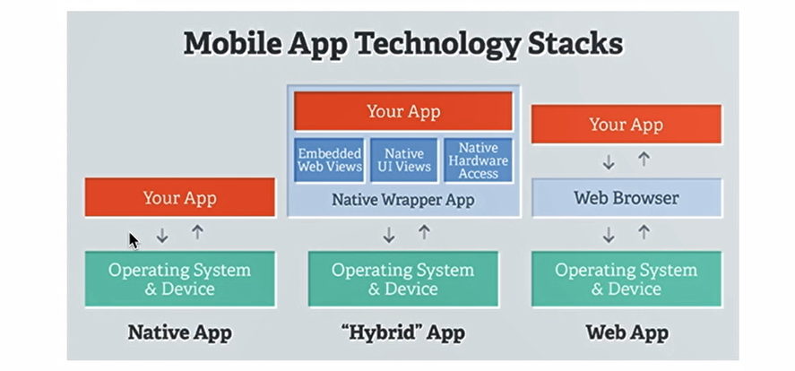
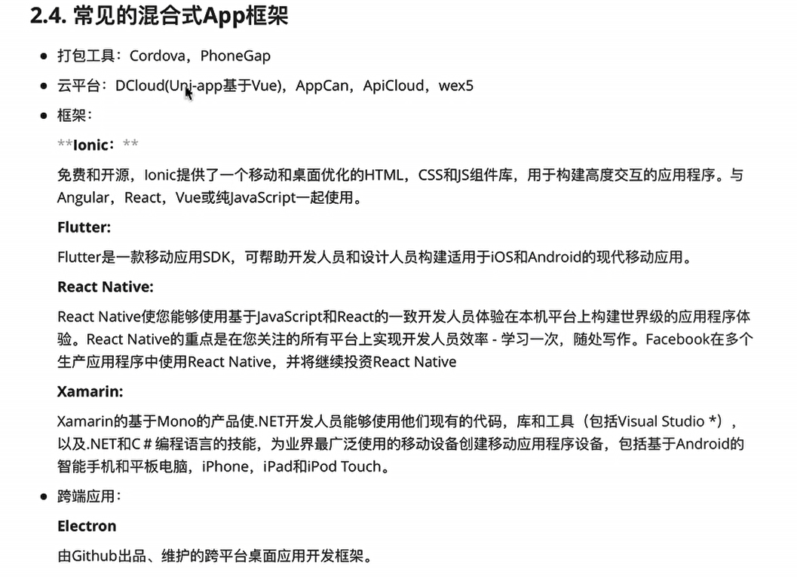
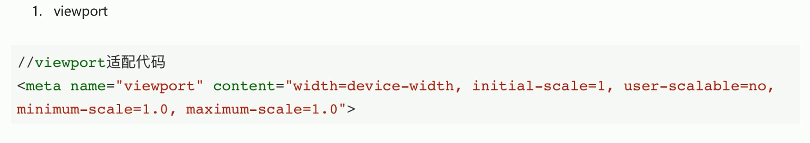

## Web App、Hybrid App、 Native App区别

Web App 指采用[Html5](https://so.csdn.net/so/search?q=Html5&spm=1001.2101.3001.7020)语言写出的App，不需要下载安装。类似于现在所说的轻应用。生存在浏览器中的应用，基本上可以说是触屏版的网页应用。

Hybrid APP指的是半原生半Web的混合类App。需要下载安装，看上去类似Native App，但只有很少的UI Web View，访问的内容是 Web 。

Native APP 指的是原生程序，一般依托于操作系统，有很强的交互，是一个完整的App，可拓展性强。需要用户下载安装使用。



# Hybrid App



## H5知识


### 页面适配



flex布局，rem,vw 

```
屏幕宽度 = 100vw  =  750rem

10rem = html font size

如果 屏幕宽 640px ，设计稿750px:

1rem = 640/750 px
html font size = 10 * 640 /750 px = 100 vw /75 


使用时，指定 fontsize = 100 vw /75 
```

关于字体，标题使用相对字号`em`,正文内容使用固定像素`px`

某些间距也不可以使用rem,使用em相对于其父元素的字体大小。`padding: 1em` 意味着内边距是父元素字体大小的一倍。

### 图片像素与设备物理像素的关系

多个物理像素点可以表示一个虚拟像素，进行插值算法进行填充颜色。

图片100px,设备300px,那么3*3个物理像素点描述一个虚拟像素点，就会插值运算，出现模糊的情况。


## cordova

原生框架，提供原生功能接口

### 安装

```
npm install -g cordova

cordova create hello com.example.hello HelloWorld   //项目名 hello,目录结构com.example.hello 

cd hello

cordova platform add ios          //添加平台
cordova platform add android

cordova platform ls   //检查您当前的平台集


cordova build ios   //构建应用程序

cordova emulate android  //模拟器中运行
cordova run android   //手机插入计算机，直接测试应用程序


```

```
cordova platform rm ios
cordova platform add ios   //更新平台

cordova prepare   //根据packjson恢复平台

npx cordova requirements     //检查依赖环境是否缺少

cordova plugin add a_plugin   //安装插件
```

### Gradle问题

手动下载Gradle编译工具，下载gradle地址：https://services.gradle.org/distributions/

添加环境变量path,C:\Users\a\gradle-8.10\bin

如果打包过程中出现timeout异常超时错误：

下载对应版本zip，把这个zip放到文件夹：~C:\Users\a/.gradle/wrapper/dists/gradle-6.8.3-bin/7ykxq50lst7lb7wx1nijpicxn 下面（注意：7ykxq50lst7lb7wx1nijpicxn是当时运行./gradlew build下载gradle版本的时候产生的一个文件夹，这个命名貌似是一串随机的id）

然后再在gradle项目下运行./gradlew build，此时发现已经可以了。


### ANDROID_SDK_ROOT报错

- 添加环境变量 ANDROID_SDK_ROOT 变量值同 ANDROID_HOME
- 以管理员身份重新打开vscode,重新执行 npx cordova run android

## ionic

https://ionic.nodejs.cn/angular/your-first-app/taking-photos

ionic负责组件ui部分，使用cordova或capacitor进行调用原生硬件功能并构建打包

```
cnpm install -g @ionic/cli native-run cordova-res

ionic start photo-gallery tabs --type=angular --capacitor

cd photo-gallery

ionic serve           //运行到浏览器
```

cordova-res 资源文件处理，自动生成所有图标

```
先按指定文件夹，定义图片，然后执行
cordova-res
```

```
ionic cap add android

ionic cap run android    //运行到安卓

ionic cap run android -l --external   //热更新
```

浏览器调试

chrome://inspect/#devices

点击inspect

###  weburl转blob转base64

```
export class PhotoService {
  public photos: UserPhoto[] = [];
  private PHOTO_STORAGE: string = 'photos';

  constructor() { }

  public async addNewToGallery() {
    // Take a photo
    const capturedPhoto = await Camera.getPhoto({
      resultType: CameraResultType.Uri,
      source: CameraSource.Camera,
      quality: 100
    });

    
    const capturedPhotoNew = await this.savePicture(capturedPhoto)
    this.photos.unshift(capturedPhotoNew);

    Preferences.set({
      key: this.PHOTO_STORAGE,
      value: JSON.stringify(this.photos),
    });
  }

  /**
   * savePicture
   */
  private async savePicture(photo: Photo) {
    // Convert photo to base64 format, required by Filesystem API to save
    const base64Data = await this.readAsBase64(photo);

    // Write the file to the data directory
    const fileName = Date.now() + '.jpeg';
    const savedFile = await Filesystem.writeFile({
      path: fileName,
      data: base64Data,
      directory: Directory.Data
    });

    // Use webPath to display the new image instead of base64 since it's
    // already loaded into memory
    return {
      filepath: fileName,
      webviewPath: photo.webPath
    };
  }


  private async readAsBase64(photo: Photo) {
    // Fetch the photo, read as a blob, then convert to base64 format
    const response = await fetch(photo.webPath!);
    const blob = await response.blob();

    return await this.convertBlobToBase64(blob) as string;
  }

  private convertBlobToBase64 = (blob: Blob) => new Promise((resolve, reject) => {
    const reader = new FileReader();
    reader.onerror = reject;
    reader.onload = () => {
      resolve(reader.result);
    };
    reader.readAsDataURL(blob);
  });
  
  
  public async loadSaved() {
    // Retrieve cached photo array data
    const { value } = await Preferences.get({ key: this.PHOTO_STORAGE });
    this.photos = (value ? JSON.parse(value) : []) as UserPhoto[];

    // more to come...
    // Display the photo by reading into base64 format
    for (let photo of this.photos) {
      // Read each saved photo's data from the Filesystem
      const readFile = await Filesystem.readFile({
        path: photo.filepath,
        directory: Directory.Data,
      });

      // Web platform only: Load the photo as base64 data
      photo.webviewPath = `data:image/jpeg;base64,${readFile.data}`;
    }
  }
}

export interface UserPhoto {
  filepath: string;
  webviewPath?: string;
}

```


## 模拟api

mock.js（虚拟数据）+json-server.js（虚拟接口）

```
const Mock = require('mockjs');
const data = Mock.mock({
  'list|100': [{
    'id|+1': 1,
    'name': '@cname',
    'avatar': '@image("100x100", "#50B347", "#FFF", "Mock.js")',
    'age|18-28': 1,
    'city': '@city',
    'phone': /^1[34578]\d{9}$/,
    'email': '@email'
  }]
});
// 将生成的数据写入 db.json 文件
require('fs').writeFileSync('./mock/db.json', JSON.stringify(data, null, 2));
```


npx json-server mock/db.json --port=10000

json-server稳定版可以直接运行js，测试版只能运行json
